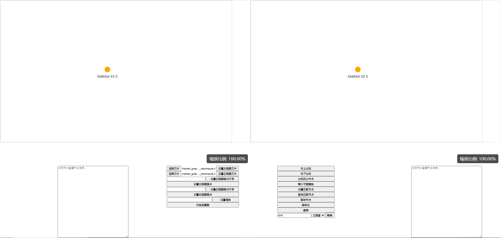
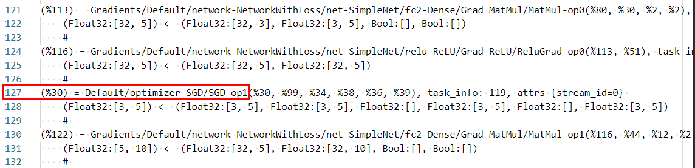
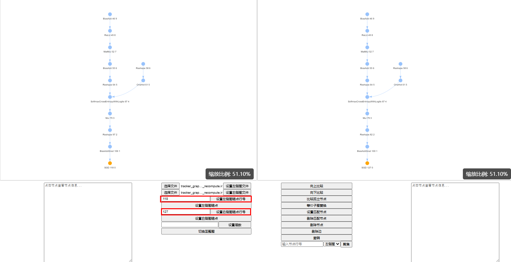
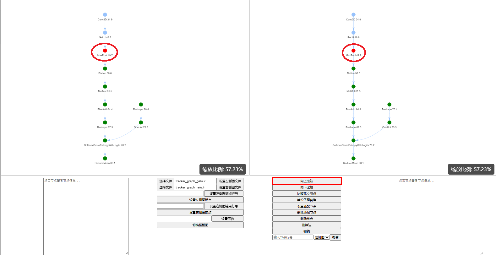

KernelGraphIdentity

# 1 说明
KernelGraphIdentity 是 MindSpore 精度定位工具，用于比较两个不同网络执行序的差异，通过比较差异加速精度问题定位。

适合使用KernelGraphIdentity的场景包括但不限于：(1)同框架不同版本比对;(2)jit加速前后执行序比对。

# 2 使用教程
## 2.1 下载程序
下载 ExecutingOrderPreCheck.exe 程序。

## 2.2 运行程序
只支持在windows平台使用。
1. 运行 ExecutingOrderPreCheck.exe 程序。

2. 程序会启动后台页面。

3. 程序自动打开浏览器页面。

4. 后台日志会记录在 exe 程序所在文件夹下，出现问题可以将该日志发送给开发人员定位。

## 2.3 界面介绍
### 2.3.1 界面组成
界面由上下两半部分组成，上半部分为显示区，显示两张图，下半部分为节点信息展示区和控制区，点击其中的功能按钮进行相关控制。

显示区分左右两张图，分别由传入的执行序文件生成。
节点信息展示区负责和展示节点在执行序图中的基本信息，包括：算子类型，输入输出数量，输入输出dtype和shape；节点堆栈或fullscopename等信息。

控制区负责选择传入执行序文件，设置锚点或锚点行号，设置比较层数或切换至整图比较以及在比对过程中进行匹配、删除、撤销等操作。

### 2.3.2 显示区节点信息
每个节点下有一行描述，包括三个信息：
1. 算子类型
2. 算子在执行序文件中的行号
3. 算子所在拓扑层数

如下图所示，算子类型为 L1LossExt，在执行序文件中的行号为 19984，所在拓扑层数为 0

### 2.3.3 节点颜色
1. 橙色为锚点。
2. 绿色为无差异的算子。
3. 蓝色为未进行差异比较的算子。
4. 红色为差异算子。
5. 黄色为选中的算子。

### 2.3.4 节点选择
1. 单击节点可以选择单个节点。
2. 按住ctrl后单击多个节点可以选择多个节点。
3. 单击空白处可以取消已选择的所有节点。

### 2.3.5 节点拖动
节点默认以拓扑分层进行展示，可能与算法逻辑不一致，可以单击节点时拖动节点，改变节点的位置。

## 2.4 功能列表
### 2.4.1 设置执行序文件
1. 点击 选择文件 按钮，选择左侧和右侧执行序文件。

2. 选择文件后，点击 设置左侧图文件 按钮，程序会读取该执行序文件到左侧图中，默认展示执行序文件中第一个算子。右侧同理。

### 2.4.2 设置锚点
设置执行序文件后默认以执行序文件中第一个算子为锚点，可以手动设置其他锚点，设置方式有如下两种方式。
#### 2.4.2.1 根据锚点在执行序文件中行号设置锚点
1. 在执行序文件中找到锚点对应的行号，如下，以 SGD 为例，左侧图行号为118，右侧图行号为127。

2. 输入行号，点击 设置左侧图锚点行号 和 设置右侧图锚点行号 按钮。锚点设置后会以拓扑分层的方式展示锚点依赖的算子，默认展示 10 层。

#### 2.4.2.2 选择图中节点作为锚点
1. 在图中点击要作为锚点的节点。设置锚点后，展示区只会保留和锚点有执行序依赖的节点。

2. 点击 设置左侧图锚点 和 设置右侧图锚点 按钮。

### 2.4.3 设置层数
默认层数 10。
输入层数，点击 设置层数 即可手动设置层数。

### 2.4.4 整图显示
点击 切换至整图 按钮，不再受 设置层数 按钮影响，左右两图同时展示所有算子的执行序，包括独立的算子。

### 2.4.5 基于锚点比较两图，寻找差异点
点击 向上比较 按钮，即可基于锚点向上自动查找差异点。绿色为无差异的点，红色为找到的差异点。
若未设置锚点，默认按照整图比对。整图比对功能主要用于同框架跨版本这种差异非常小的场景。

点击 向下比较 按钮，可以在选择锚点后确定的子图中，从上往下进行比较。

识别到的差异有三种：
1. 差异点在对面图中没有对应的算子。
2. 差异点前驱算子不同。
3. 差异点前驱算子相同，但前驱算子输入输出地址属性（dtype、shape、stride和offset）不同。

### 2.4.6 通过节点融合消除差异
以上图为例，差异原因是左侧使用了GeLU算子，右侧使用了ReLU算子。

选中右侧ReLU算子，再选中左侧GeLU算子，点击 等价子图替换 按钮。

融合后的效果：
可看到两边差异算子被融合成一致算子,整图比对通过。

### 2.4.7 多锚点比较
查询到差异点后可能不想通过节点融合来消除差异，而是想继续看后续是否有其他差异，此时可以在原来比较结果的基础上选择两张图中认为匹配的点，在此基础上查询其他差异。
具体步骤如下：
1. 点击 比较 按钮查询差异。
2. 选择认为匹配的点，点击 设置匹配节点 按钮，该过程可以执行多次。
3. 点击 向上比较/向下比较 按钮，查询基于设置的匹配节点的差异。

### 2.4.8 删除匹配节点和撤销
在比对的过程中，可能出现之前的匹配节点设置错误的情况。此时可以再次点击左右两侧的错误匹配的节点，使用 删除匹配节点 的功能取消匹配关系，重新比对。
撤销 功能可以撤销上一步操作，避免错误操作影响比对。

### 2.4.9 删除节点与删除边
在比对的过程中，可能出现部分节点和连边出现差异，但不影响整体比对的情况，在这种情况下，可以使用 删除节点 和 删除边 功能，将不相关的节点从显示区移除，移除后可再进行比较。

# 3 使用场景及用例
* [应用场景1：单算子差异执行序比对](examples/silu_gelu/simple_doc.md#应用场景1单算子差异执行序比对)
* [应用场景2：同框架不同版本比对](examples/matmul/matmul.md#应用场景2同框架不同版本比对)
* [应用场景3：jit加速场景执行序比对](examples/jit/jit.md#应用场景3jit加速场景执行序比对)