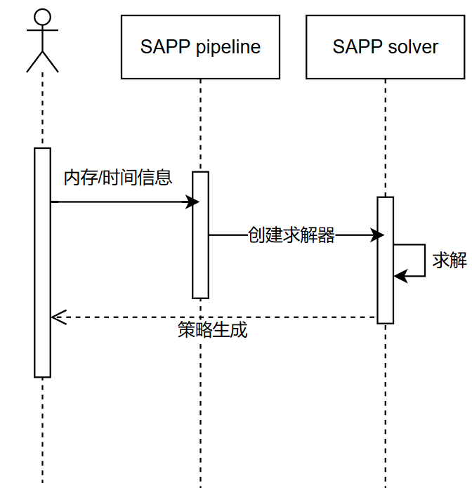
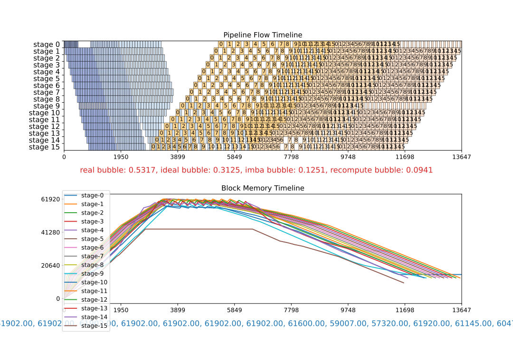
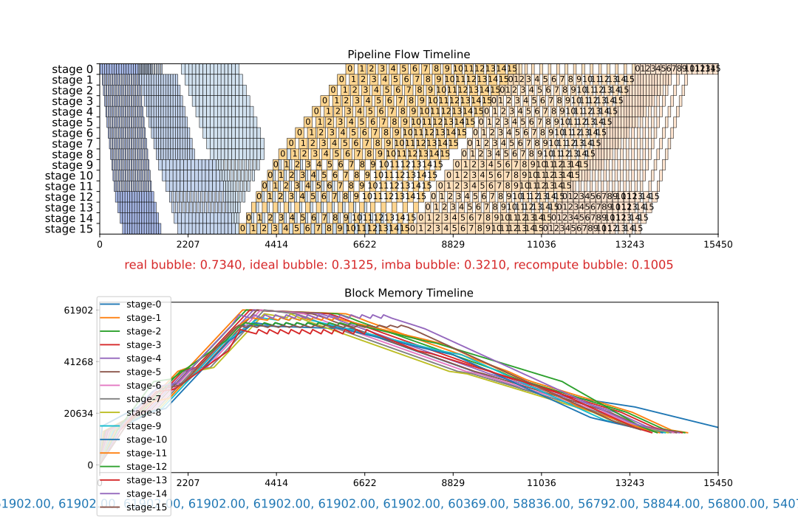
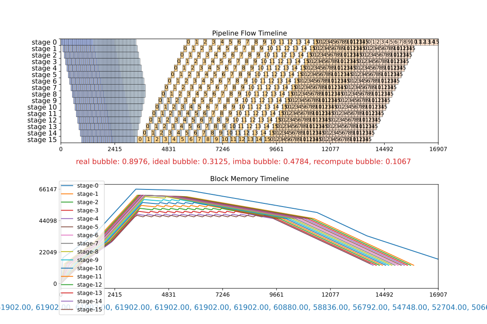
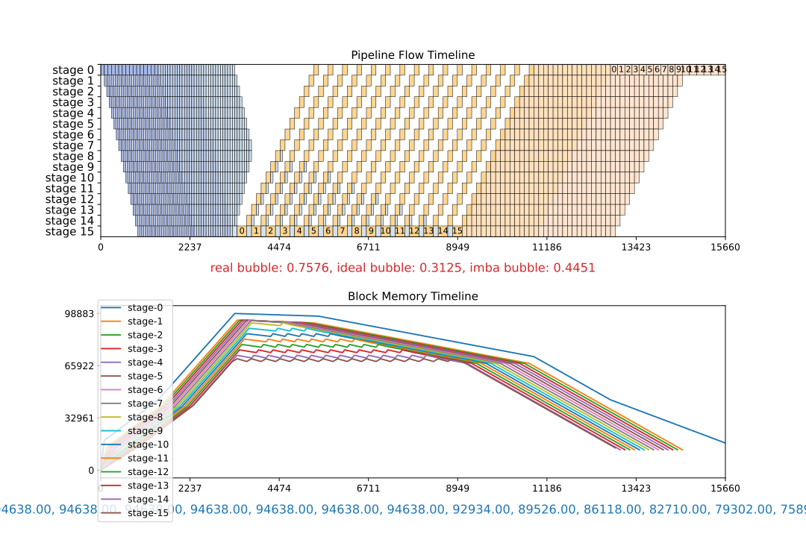
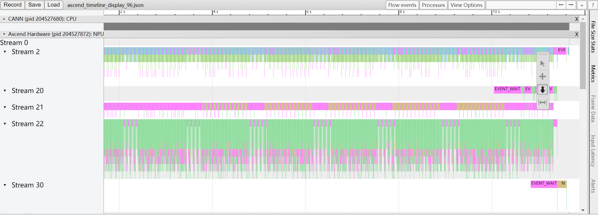
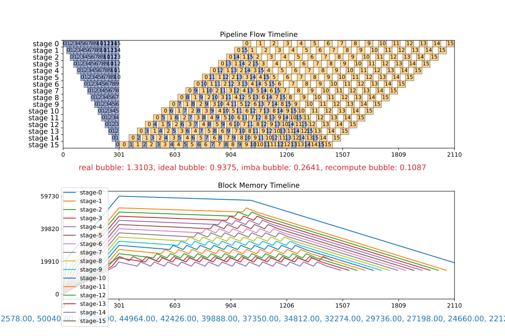
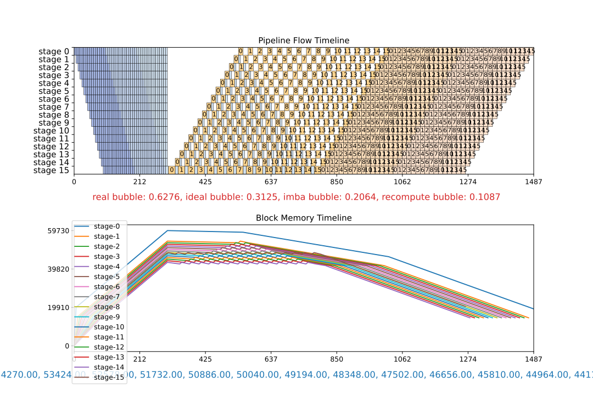
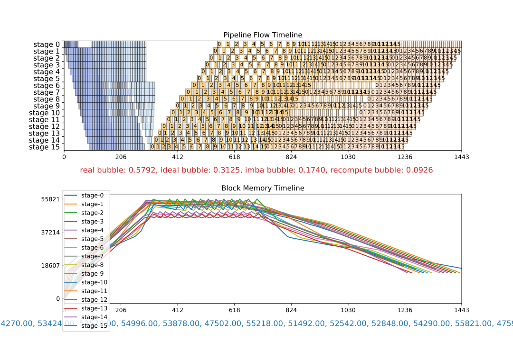

# SAPP流水线负载均衡

流水线并行（pipeline parallelism）可以将神经网络模型切分为不同部分，映射到不同阶段，每个stage部署到集群上不同的节点。从而让集群可以容纳更大的模型。目前的流水线并行编排方式会带来不同设备上计算和内存开销的不均衡。要达到最佳性能，必须同时均衡计算和内存的负载。

在训练和微调阶段，大模型需要切分到4个及以上的流水线stage时，手工调优很难短时间找到最优解。如果引入流水线交织（pipeline interleave）技术，则调优难度更大。此时就需要使用SAPP流水线负载均衡工具自动生成最优策略。

使用工具的总体流程如下：


1.用户修改工具配置文件提供模型的profiling数据或者timeline信息
2.工具自动解析profiling数据或者直接读取timeline信息
3.工具拉起dryrun并解析模型内存信息
4.工具基于这些信息自动构建线性规划问题，通过全局求解给出一个最优的重计算和负载偏置（offset）策略


## 使用指南


### 一键启动

step1. 使用工具前需修改配置文件`toolkit\pipeline_balance\cfgs\auto_ppb_config.yaml`。 通常需要修改的配置为`profiling_config`，`training_config`，和`model_type`。详细介绍见[工具配置文件](./doc/auto_ppb_config.md)。


step2. 环境变量PYTHONPATH中添加MindFormers根目录的绝对路径。

```bash
export PYTHONPATH=<MindFormers_dir>
```

在toolkit/pipeline_balance目录下执行

```bash
python run_pipeline_balance.py -auto -m <model_name> -mb <micro_barch_num> -mem <max_mem> -s <stage_num> -i <vpp_num> -seq <seq_split_num> -lm <1/0> -t <time_limit> -o <output_path>
```

参数含义：

| 参数 | 含义 | 取值范围 |
| :----: |----|:----:|
| `-auto` | 开启全自动模式 |  |
| `-m` | 模型名称（自定义），auto_ppb_config分析后存成一个同名json文件提供给算法接口 | str，默认"model_name" |
| `-mb` | micro batch数 | int，默认4 |
| `-mem` | 最大可用显存，单位为mb | int，默认56000 |
| `-s` |流水线stage数| int，默认4 |
| `-seq` |seq流水线中的sequence切分数| int，默认1 |
| `-i` |pipeline interleave数 |int，默认1|
| `-lm` |大小内存 | int, 仅在pipeline interleave > 1的时候生效，0为大内存，1为小内存，二者为两种不同的流水线调度方式，小内存方案的调度方式可以节省更多的峰值内存。默认为大内存。|
| `-t` | 求解器搜索时间的上限，以秒为单位，达到时间上限后求解器停止搜索 | int，默认90 |
| `-o` | 输出文件夹， 包括dryrun，validate的日志和配置文件，算法结果，和运行日志 | str, 默认`./output` |


step3. 运行上述命令后会进入交互。 工具会询问流水线stage数和模型层数，以及调优涉及的重计算，随后返回自动dryrun的配置并得到各个stage的峰值内存。例如，对于一个96层的模型，假设流水线stage数为16，调优时考虑选择重计算和通信重计算，且二者可能重叠的时候，工具会给出如下包含了offset和重计算的配置。

注意：layer层数不能等于stage数。

```plain
Please enter the pipeline stage number (0 if none): 16
Please enter the number of layers (0 if none): 96
Do you consider full recomputation?[y/n]? n
Do you consider select recomputation?[y/n]? y
Does your communication recomputation co-work with select recomputation?[y/n]? y
Do you consider extra communication recomputation?[y/n]? y
2025-02-17 21:20:12,683 - pipeline_balance - OUTPUT - Please dryrun following config, 1 round(s) is needed
2025-02-17 21:20:12,684 - pipeline_balance - OUTPUT - for round 1, please dryrun config:
        offset: [0, 0, -4, -2, 2, -2, -2, 10, -2, -2, -2, 0, 2, 2, 0, 0]
        recompute: [0, 0, 0, 0, 0, 0, 0, 0, 0, 0, 0, 0, 0, 0, 0, 0]
        select_recompute: [5, 5, 2, 1, 4, 3, 2, 14, 4, 4, 4, 6, 1, 5, 5, 6]
        select_comm_recompute: [0, 5, 0, 1, 1, 4, 2, 2, 1, 3, 2, 6, 4, 5, 5, 1]
```


step4. 交互完成后会进入全自动流程。工具会自动dryrun获取内存数据， 日志保存在输出文件夹中。 成功获取多个stage的峰值显存数据后，工具会进行模型内存分解，自动执行算法，在输出结果中可以看到推荐策略，以及这个策略的流水线bubble：


```plain
To put in yaml configuration:
  offset: [[-1, 0, 0, -1, -2, 0, 0, 0, 0, 0, 1, 1, 1, 1, 1, -1]]
  recompute: [[0, 0, 0, 0, 0, 0, 0, 0, 0, 0, 0, 0, 0, 0, 0, 0]]
  select_recompute: [[5, 6, 5, 5, 0, 3, 6, 6, 1, 1, 1, 1, 1, 1, 1, 0]]
  select_comm_recompute: [[5, 4, 5, 0, 0, 3, 0, 0, 1, 4, 0, 0, 0, 0, 0, 0]]
————————————— pp:16, vp: 1, micro: 16 ————————————
--------------------  bubble  --------------------
   real    =   ideal   +   imba    + recompute
  1.1064   =  0.9375   +  0.1382   +  0.0307
```

bubble一栏各项所表达的含义如下：

`real`为流水线并行中的总bubble；

`ideal`为理论最小bubble；

`imba`为各stage间计算不平衡带来的bubble；

`recompute`为重计算引入的bubble。


### 策略快捷生成


成功执行[一键启动](#一键启动)流程后， 工具会在`layers`文件夹下生成一个json文件， 用于记录模型的信息分析结果。 若模型的时间信息不变，可直接使用这个时间信息运行策略快捷。


在toolkit/pipeline_balance目录下执行

```bash
python run_pipeline_balance.py  -lf <layer_file> -mb <micro_barch_num> -mem <max_mem> -s <stage_num> -i <vpp_num> -seq <seq_split_num> -lm <1/0> -t <time_limit> -o <output_path>
```

新增参数含义：

| 参数 | 含义 | 取值范围 |
| :----: |----|:----:|
| `-lf` | 模型时间信息解析json文件地址 | str|


执行上述命令后，工具会跳过和[一键启动](#一键启动)流程中解析模型的时间信息的部分，直接读取模型时间信息并进入后续流程。


## 精确调优

### 使用Profiling提供精确性能数据

<!-- 注：当pp=2或pp=4的时候可以参考[快速调优](#手工快速调优手册)。 -->

Step.1 收集模型的Profiling信息，可参考下文[使用Profiling获取性能数据](#使用profiling获取性能数据)。完成了Profiling会在ASCNED_PROFILER_OUTPUT下自动生成名为trace_view.json的timeline文件。为了有效分析模型的时间信息，至少要有头尾两个stage和中间任意一个stage的Profiling信息。将这些stage的trace_view.json文件统一放置在任意文件夹中，此处记为`/timeline/path`。一个stage最多只能放置一个文件。

例如，在8张卡上执行stage数为4的模型，把0卡、2卡和7卡的trace_view.json统一放到文件夹`/timeline/path`下即可。

```bash
ls /timeline/path

trace_view0.json trace_view2.json trace_view7.json
```

Step.2 在`auto_ppb_config` 中修改 `profiling_config`，使其与收集的Profiling数据匹配。在执行[一键启动](#一键启动)后，若提供的Profiling数据完整，工具会自动使用Profiling数据分析模型的时间信息来替代`auto_ppb_config`中提供的`time_config`。


### 比较不同的策略

为了在调优时判断SAPP工具生成的策略是否较优，我们提供了接口对不同策略进行模拟，并生成模拟结果以供比较。工具可生成两种结果作为对照：一种是基于两个naive策略的结果，另一种是基于用户提供的手工策略的结果。二者可同时与工具结果进行比较。

> 注意：如果在init文件中只配置了某种重计算，那么模拟的时候是无法考虑其它重计算的。比如init的时候yaml文件中只提供了完全重计算，那么无法生成考虑了选择重计算的naive或者手工策略。

1. 自动生成naive策略

当模型层数能被流水线层数与流水线interleave数的乘积所整除的时候，且init的时候提供了完全重计算的显存开销。在执行时加上`-naive 1`即会自动给出重计算开满和重计算不开这两种情形下模拟器的模拟结果。

```bash
python run_pipeline_balance.py --init ./cfgs/init_demo.yaml -m demo -s 16 -i 3 -mb 16 -mem 62000 -t 150 -naive 1
```

同时除了求解出的推荐策略之外，会在`output`目录下生成另外两个svg文件，result_naive_no_recomp以及result_naive_all_recomp：

```bash
$ ls ./output

result.svg result_naive_no_recomp.svg result_naive_all_recomp.svg
```

2. 生成人工策略的结果

```bash
python run_pipeline_balance.py --init ./cfgs/init_demo.yaml -m demo -s 16 -i 3 -mb 16 -mem 62000 -t 150 -manual cfgs/manual_demo.yaml
```

manual.yaml的格式如下：

```yaml
# simulate configs
manual1:
  offset:  [[-1, -1, -1, -1, -1, -1, -1, -1, -1, -1, -1, -1, 0, 0, 0, 0], [-1, 0, 0, 0, 0, 0, 0, 0, 0, 1, 1, 1, 0, 0, 1, 1], [1, 1, 1, 1, 1, 1, 1, 1, 1, 0, 0, 0, 0, 0, 0, -1]]
  recompute: false
  select_recompute: [[1, 1, 1, 1, 1, 1, 1, 1, 1, 1, 1, 1, 2, 2, 2, 2], [1, 2, 2, 2, 2, 2, 2, 2, 2, 3, 3, 3, 2, 2, 3, 3], [3, 3, 3, 3, 3, 3, 3, 3, 3, 2, 2, 2, 2, 0, 1, 0]]
  select_comm_recompute: [[1, 1, 1, 1, 1, 1, 1, 1, 1, 1, 1, 0, 1, 2, 2, 2], [1, 2, 2, 2, 2, 2, 2, 2, 2, 3, 3, 3, 2, 2, 3, 3], [3, 3, 3, 3, 3, 3, 3, 3, 3, 2, 2, 2, 2, 0, 1, 0]]
  interleave_num: 3
  show: True
  file_name: "manual1.svg"
```

下图展示了推荐策略和naive、人工策略的比较。图片的上半部分是流水线的模拟，下半部分是各个stage内存占用的演化。上半部分的横坐标代表着时间，通过横坐标的最大值可以比较不同策略的性能。

可以看到重计算开满的时候性能会比较差，而不开重计算则会超过显存上限。工具求出的策略则会在显存上限的约束下得到最优的性能，这可以通过和人工策略的比较得到确证。见下图：
|算法结果             |  手工调优|
|:-------------------------:|:-------------------------:|
 | |

| 全量使用重计算             |  关闭重计算|
|:-------------------------:|:-------------------------:|
|||


## 内存数据和性能数据的收集

在调优过程中，profiling可以给出模型执行的性能数据，而DryRun可以给出具体Device的内存数据。这两项技术对于调优有重大意义，这里简述使用方法。


### 使用Profiling获取性能数据

在mindformers训练任务的config中配置如下字段可以激活profiling。

```yaml
profile: True # 开启或关闭profiling
profile_start_step: 3 # 在某个step开始
profile_stop_step: 4 # 在某个step结束
```

生成的`trace_view.json`可以在`chrome://tracing`中展示。可视化算子级的性能数据。如图：



如果想要得到第一个stage的信息就打开rank0的profiling，最后一个rank的profiling可以代表最后一个stage的信息。查看profiling是为了获得init文件中需要的head、body和tail时间。其中head的时间一般体现为embedding算子所占的时间，body的时间是一层decode layer的时间，tail的时间是最后lm_head和loss所占的时间。只要在profiling中查找对应的算子即可。

详细文档也可见[mindspore的profiling指南](https://www.mindspore.cn/docs/zh-CN/master/model_train/optimize/profiler.html)。

### 使用DryRun获取内存数据

DryRun对模型进行模拟编译，可以给出被模拟的device的内存占用。

设置如下环境变量，即可开启DryRun。

```bash
export MS_SIMULATION_LEVEL=1
export MS_KERNEL_LAUNCH_SKIP=all
export MS_MEMORY_STATISTIC=1
```

工具也提供了一个Dryrun的[参考脚本](./utils/dryrun.sh)，执行：

```bash
bash dryrun.sh "python run_mindformer.py --config <config_file> " <rank_size> <stage_num> <output_folder>
```

其中，

`config_file`是MindFormers的训练任务配置文件，`rank_size`是训练的总卡数，`stage_num`是流水线stage数，`output_folder`是输出文件夹。

执行结束后会在output_dryrun目录下面产生每个stage（即每个stage的第一个rank）的日志。日志的末尾会给出内存信息，可以通过`grep -rn 'Used peak' <output_folder> | sort -t'_' -k2,2n`进行收集。如下，Used peak可以认为是模型内存占用的理论值，而Actual peak则是加上了由于碎片等内存分配机制带来的额外开销后的真实值。

```plain
Device MOC memory size: 62432M
MindSpore Used memory size: 59392M
MindSpore memory base address: 0
Used peak memory usage (without fragments): 48874M
Actual peak memory usage (with fragments): 48874M
```


## 算法原理

工具在构建线性规划的时候，需要有流水线各个阶段的内存数据作为输入，这里将简述内存计算的原理，以及第一次执行该如何配置。

### 内存分解原理

内存是通过线性方程组的求解得以分解的。 假设有一个stage数为$pp$的流水线，每个stage的内存值为$M_i$，stage中的layer数为$n_i$，重计算层数为$r_i$，$i$为stage id。

内存将被分解为如下几项：

`mem_par`: 每个layer由参数带来的内存

`mem_act`: 每个layer前向算出的激活值占的内存

`mem_rec`: 开启重计算之后mem_act所占的内存

`mem_head`: 首stage的额外内存（比如embedding带来的内存）

`mem_tail`: 尾stage的额外内存（比如LM_head带来的内存）

`mem_const`: 每个stage中由优化器等带来的固定开销。

这些内存构成构成如下关系：

$$
m_i = n_i \times mem\_par + (pp - i) \times (r_i \times mem\_rec + (n_i-r_i) \times mem\_act) + mem\_const
$$

$$
M_i =
\begin{cases}
m_i + mem\_head \quad i = 0 \\
m_i + mem\_tail \quad i = pp - 1 \\
m_i \quad else
\end{cases}
$$

这里涉及了6个未知量，也就需要建立6个方程去求解。如果涉及不止一种重计算，比如同时有完全重计算和选择重计算，此时就需要有7个stage的数据才能求解。

综上需要如下stage的显存开销：

第一个stage和最后一个stage，加上 (3 + 重计算种类) 个中间stage。重计算种类有完全重计算、选择重计算和通信重计算。

注意，此时这些中间stage的offset不能配置成完全一样，否则方程组无法求出`mem_const`。

如果只提供了 (2 + 重计算种类) 个中间stage，那么工具会放弃计算`mem_const`，可能会带来内存误差。

### 有解配置

为了让工具能够分解模型的内存，需要先运行一次模型得到各个stage的内存。这一次运行要求重计算和offset的配置能让上述的线性方程组有解。建议通过`python run_pipeline_balance.py --guide`让工具给出配置。

### 求解模式：线性规划

内存分解了之后，和模型的时间信息整合起来构成了模型抽象的符号化表达。工具会把这些符号进行编排，构建出内存和模型执行的约束，在这些约束下以最小化端到端时间为优化方向求解线性规划问题，最后得到最优的offset和重计算策略。

## llama调优实例

下面以MindFormers中提供的llama2模型为基础，通过负载均衡工具调优一个175B的llama2网络。

假设有配置文件llama_175B.yaml，给出模型参数如下：

```yaml
model:
  model_config:
    type: LlamaConfig
    batch_size: 1 # add for increase predict
    seq_length: 8192
    hidden_size: 12288
    num_layers: 96
    num_heads: 96
    vocab_size: 160000
    intermediate_size: 53248
    ffn_dim_multiplier: 3.25
    n_kv_heads: 16
    multiple_of: 256
    rms_norm_eps: 1.0e-5
    bos_token_id: 1
    eos_token_id: 2
    pad_token_id: -1
    ignore_token_id: -100
    compute_dtype: "bfloat16"
    layernorm_compute_type: "float32"
    softmax_compute_type: "float16"
    rotary_dtype: "float32"
    param_init_type: "float32"
    res_dtype: "float32"
    use_flash_attention: True
    concat_qkv: False
    pp_interleave_num: 1
    fine_grain_interleave: 2
    offset: 0
```

注意，当`pp_interleave_num`为1的时候，需要将`pipeline_config`中的`pipeline_interleave`设置成false。

首先需要进行一次profiling，将得到的trace_view.json文件放在目录`/timeline/path`下。

为了模拟编译（dryrun）之后可以分解出各项内存值，执行`python run_pipeline_balance.py --guide`，工具给出如下配置，根据这些配置执行dryrun：

```yaml
offset: [0, 0, -4, -2, 2, -2, -2, 10, -2, -2, -2, 0, 2, 2, 0, 0]
recompute: false
select_recompute: [5, 5, 2, 1, 4, 3, 2, 14, 4, 4, 4, 6, 1, 5, 5, 6]
select_comm_recompute: [0, 5, 0, 1, 1, 4, 2, 2, 1, 3, 2, 6, 4, 5, 5, 1]
```

使用本工具utils下提供的dryrun.sh脚本进行dryrun。

```bash
export PYTHONPATH=<MindFormers_dir>
cp utils/dryrun.sh ../../
cd ../../ # back to the root folder of MindFormers
bash dryrun.sh "python run_mindformer.py --config ./configs/llama2/llama_175B.yaml" 16384 16 output_dryrun
```

按如下方式收集memory usage：

```bash
grep -rn 'Used peak' output_dryrun | sort -t '_' -k2,2n
```

得到结果如下：

```plain
stage_0_rank_0/mindformer.log:5478:Actual peak memory usage (with fragments): 96643M
stage_1_rank_1024/mindformer.log:5482:Actual peak memory usage (with fragments): 60854M
stage_2_rank_2048/mindformer.log:5458:Actual peak memory usage (with fragments): 27620M
stage_3_rank_3072/mindformer.log:5470:Actual peak memory usage (with fragments): 54533M
stage_4_rank_4096/mindformer.log:5494:Actual peak memory usage (with fragments): 100631M
stage_5_rank_5120/mindformer.log:5470:Actual peak memory usage (with fragments): 31713M
stage_6_rank_6144/mindformer.log:5470:Actual peak memory usage (with fragments): 38874M
stage_7_rank_7168/mindformer.log:5542:Actual peak memory usage (with fragments): 146986M
stage_8_rank_8192/mindformer.log:5470:Actual peak memory usage (with fragments): 31713M
stage_9_rank_9216/mindformer.log:5470:Actual peak memory usage (with fragments): 24553M
stage_10_rank_10240/mindformer.log:5470:Actual peak memory usage (with fragments): 24553M
stage_11_rank_11264/mindformer.log:5482:Actual peak memory usage (with fragments): 28484M
stage_12_rank_12288/mindformer.log:5494:Actual peak memory usage (with fragments): 45016M
stage_13_rank_13312/mindformer.log:5494:Actual peak memory usage (with fragments): 33763M
stage_14_rank_14336/mindformer.log:5482:Actual peak memory usage (with fragments): 20463M
stage_15_rank_15360/mindformer.log:5496:Actual peak memory usage (with fragments): 23531M
```

在pipeline_balance/cfgs中新建文件init_llama.yaml，将结果填入其中：

```yaml
# pipeline_config
pipeline_config:
  pipeline_num: 16
  num_layer: 96
  offset: [0, 0, -4, -2, 2, -2, -2, 10, -2, -2, -2, 0, 2, 2, 0, 0]

# profiling_config
profiling_config:
  micro_batch_num: 8
  folder_path: "/timeline/path"

# recompute_config
recompute_config:
  recompute: false
  select_recompute: [5, 5, 2, 1, 4, 3, 2, 14, 4, 4, 4, 6, 1, 5, 5, 6]
  select_comm_recompute: [0, 5, 0, 1, 1, 4, 2, 2, 1, 3, 2, 6, 4, 5, 5, 1]

# head memory and tail memory are necessary.
# num of body memories = type of recompute + 2 --> the influence of implicit constant memory is not considered
# num of body memories >= type of recompute + 3 --> the influence of implicit constant memory is considered
memory_usage:
  head_memory: 96643
  tail_memory: 23531
  body_memories:
    stage_id: [1,2,3,4,5,6,7,8,9,10,11,12,13,14]
    memories: [60854,27620,54533,100631,31713,38874,146986,31713,24553,24553,28484,45016,33763,20463]
```

执行：

```bash
python run_pipeline_balance.py --init ./cfgs/init_llama.yaml -m demo -s 16 -i 3 -mb 16 -mem 56000 -lm 1 -t 600
```

输出日志中给出最优策略：

```plain
To put in yaml configuration:
  offset: [[-1, 0, 0, 0, 0, 0, 0, 0, 0, 0, 0, 0, 0, 0, 0, 0], [0, 0, 0, 0, 0, 0, -1, 0, -1, 0, -1, 0, 0, 0, 0, 0], [0, 0, 0, 0, 0, 0, 1, 1, 1, 0, 1, 0, 1, 0, 0, -1]]
  recompute: [[0, 0, 0, 0, 0, 0, 0, 0, 0, 0, 0, 0, 0, 0, 0, 0], [0, 0, 0, 0, 0, 0, 0, 0, 0, 0, 0, 0, 0, 0, 0, 0], [0, 0, 0, 0, 0, 0, 0, 0, 0, 0, 0, 0, 0, 0, 0, 0]]
  select_recompute: [[1, 2, 2, 2, 2, 2, 2, 2, 2, 2, 2, 2, 2, 2, 1, 2], [2, 2, 2, 2, 2, 2, 1, 2, 1, 2, 1, 2, 2, 2, 2, 2], [1, 2, 2, 2, 1, 1, 3, 3, 0, 2, 0, 0, 0, 0, 1, 1]]
  select_comm_recompute: [[1, 2, 2, 2, 2, 2, 2, 2, 2, 2, 2, 2, 2, 2, 2, 2], [2, 2, 2, 2, 2, 2, 1, 2, 1, 2, 1, 1, 2, 2, 2, 2], [2, 2, 2, 2, 2, 2, 3, 3, 3, 0, 0, 2, 0, 0, 1, 0]]
```

之后把生成的策略配置到模型yaml文件中的对应配置项即可。

如下图可以看到，同样是vpp3，在最大设备内存只有56GB可用的情况下，未经过算法调优，即使重计算开满显存依旧不够，而算法得出的策略相比于重计算全开的配置在计算层面性能提升的同时，还满足内存要求。而相比于vpp1则可以把性能提高31%。

| vpp1全量使用重计算  | vpp3全量使用重计算 | 算法结果|
|:-------------------------:|:-------------------------:|:-------------------------:|
||||

### 手工快速调优手册

当pp数比较少（pp=2/4）切不开vpp的时候，如果只调优完全重计算的话可以用以下简便办法快速调优。要点在于stage中多加一层等于多开了三层重计算。

*pp=2*

当pp=2的时候，二者内存上基本是均衡的，此时只需调整重计算让内存满足要求即可。

*pp=4*

先不设置offset，通过调节重计算让各stage满足内存要求。此时再考虑每个stage时间的均衡。
设decodeLayer的前向时间为T，如果一个stage有$n$层layer，开启了$r$层重计算，embedding的前向时间是$eT$，lm head的前向时间$lT$。

$$
stage\_time =
\begin{cases}
(T*(n+e))\times 3+rT \quad head \\
(T*(n+l))\times 3+rT \quad tail \\
(T*(n))\times 3+rT \quad else
\end{cases}
$$

遵循以下的方式即可完成均衡。

```plain
while(max(Mem_stage) < max_device_mem):
  min(max(stage_time) - min(stage_time))
```
