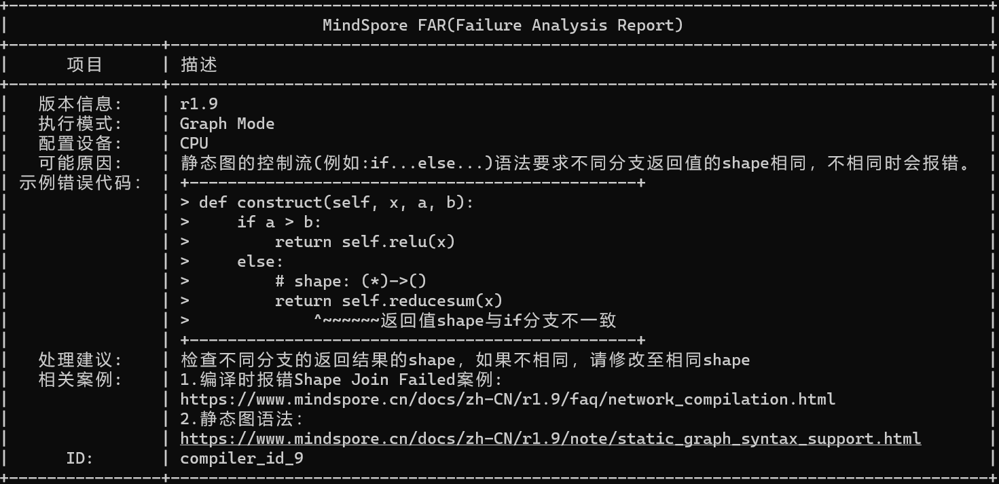

TroubleShooter

A troubleshooting toolbox for MindSpore

# 说明
TroubleShooter 是MindSpore 网络开发调试工具包，用于提供便捷、易用的调试能力。

# 安装说明
pip install troubleshooter

# 应用场景

## 网络错误调试
* 应用场景1：网络抛出异常后自动生成报错处理建议（在线分析）
* 应用场景2：已产生的报错生成处理建议（离线分析）
* 应用场景3：显示简洁异常调用栈(屏蔽部分框架调用栈信息)

## 网络执行跟踪
* 应用场景1：打印运行时的网络信息(结构、shape)
* 应用场景2：获取INF/NAN值抛出点
* 应用场景3：按照路径黑/白名单过滤跟踪信息
* 应用场景4：跟踪API报错的详细执行过程

## 网络迁移&调试
* 应用场景1：pth到ckpt权重转换
* 应用场景2：将转换后的ckpt与MindSpore网络生成的ckpt进行对比
* 应用场景3：比较两组tensor值(npy文件)是否相等

## 其他调试功能
* 应用场景1：tracking在指定epoch/step停止跟踪（使用model.train训练）

## 网络错误调试-使用Proposal功能自动分析报错

### 应用场景1：自动生成报错处理建议（在线分析）
用户在使用MindSpore开发网络时，经常会遇到因各种原因导致的MindSpore报错，此功能自动进行MindSpore报错分析并提供分析报告，分析报告包含：MindSpore版本信息、可能原因、处理建议、相关案例等内容，辅助用户解决相关问题。
#### 结果展示：

#### 如何使用：

##### 方法1：使用装饰器 @ts.proposal()
        import numpy as np
        import mindspore
        from mindspore import ops, Tensor, nn
        import troubleshooter as ts

        class Net(nn.Cell):
            def __init__(self):
                super().__init__()
                self.relu = ops.ReLU()
                self.reducesum = ops.ReduceSum()

            def construct(self, x, a, b):
                if a > b:
                    return self.relu(x)  # shape: (2, 3, 4, 5), dtype:Float32
                else:
                    return self.reducesum(x)  # shape:(), dype: Float32

        # 通过装饰器，装饰在执行函数前
        @ts.proposal()
        def main():
            input_x = Tensor(np.random.rand(2, 3, 4, 5).astype(np.float32))
            input_a = Tensor(2, mindspore.float32)
            input_b = Tensor(6, mindspore.float32)
            net = Net()
            out = net(input_x, input_a, input_b)

        if __name__ == '__main__':
            main()

##### 方法2：使用with ts.proposal()
    import numpy as np
    import mindspore
    from mindspore import ops, Tensor, nn
    import troubleshooter as ts

    class Net(nn.Cell):
        def __init__(self):
            super().__init__()
            self.relu = ops.ReLU()
            self.reducesum = ops.ReduceSum()

        def construct(self, x, a, b):
            if a > b:
                return self.relu(x)  # shape: (2, 3, 4, 5), dtype:Float32
            else:
                return self.reducesum(x)  # shape:(), dype: Float32

    # 通过with 来实现片段代码分析
    with ts.proposal():
        input_x = Tensor(np.random.rand(2, 3, 4, 5).astype(np.float32))
        input_a = Tensor(2, mindspore.float32)
        input_b = Tensor(6, mindspore.float32)
        net = Net()
        out = net(input_x, input_a, input_b)

### 应用场景2：已生成的报错自动分析（离线分析）
参考如下例子构建用例，将MindSpore的报错信息，从第一个Traceback (most recent call last): 到最后一行打印的信息，全部拷贝到字符串中，使用raise抛出，即可被proposal捕获并分析。

        import troubleshooter as ts
        
        @ts.proposal()
        def main():
            error = """
            Traceback (most recent call last):
              File "/mnt/d/06_project/trouble-shooter/examples/proposal_demo_1.py", line 25, in <module>
                out = net(input_x, input_a, input_b)
              File "/root/envs/lib/python3.7/site-packages/mindspore/nn/cell.py", line 596, in __call__
                out = self.compile_and_run(*args)
              File "/root/envs/lib/python3.7/site-packages/mindspore/nn/cell.py", line 985, in compile_and_run
                self.compile(*inputs)
              File "/root/envs/lib/python3.7/site-packages/mindspore/nn/cell.py", line 957, in compile
                jit_config_dict=self._jit_config_dict)
              File "/root/envs/lib/python3.7/site-packages/mindspore/common/api.py", line 1131, in compile
                result = self._graph_executor.compile(obj, args_list, phase, self._use_vm_mode())
            ValueError: Cannot join the return values of different branches, perhaps you need to make them equal.
            Shape Join Failed: shape1 = (2, 3, 4, 5), shape2 = ().
            For more details, please refer to https://www.mindspore.cn/search?inputValue=Shape%20Join%20Failed
            ......    
            ----------------------------------------------------
            - C++ Call Stack: (For framework developers)
            ----------------------------------------------------
            mindspore/ccsrc/pipeline/jit/static_analysis/static_analysis.cc:850 ProcessEvalResults
            """
            raise ValueError(error)

        if __name__ == '__main__':
            main()

### 应用场景3：显示简洁异常调用栈(删除部分框架栈信息)
部分框架内部栈信息会影响用户阅读调用栈，此功能以黑名单方式过滤掉部分栈信息，使网络调用栈打印的更为简洁，用户更容易观察到框架调用关系。

#### 结果展示：
开启前

开启后

#### 如何使用：配置print_clear_stack=True参数（默认False）

        @ts.proposal(print_clear_stack=True)
        def test_lent():
            context.set_context(mode=context.PYNATIVE_MODE, device_target="CPU")
            x = np.arange(1 * 24 * 24).reshape(1, 1, 24, 24)
            x = Tensor(x, ms.float32)
            net = LeNet5()
            out = net(x)
    
## 网络执行跟踪-使用tracking功能跟踪网络执行

***说明：tracking功能仅能跟踪python代码，功能仅对PyNative模式有效果，图模式仅能跟踪Python阶段信息***

### 应用场景1：打印运行时的网络信息(结构、shape)
#### 结果展示：

#### 如何使用：
跟踪可以通过level参数控制跟踪信息
* level=1(默认) 仅跟踪用户脚本中的construct函数
* level=2 跟踪用户脚本以及MindSpore主要的Python执行代码
* level=3 跟踪用户脚本以及MindSpore的全部Python执行代码
* level=4 跟踪用户脚本、MindSpore、Python库以及第三方包的所有Python执行代码

通过depth控制跟踪的调用栈深度，一般不需要调整，如果需要跟踪的代码调用层级很深，可通过配置depth解决
* depth=15(默认)

##### 方法1：使用装饰器 @ts.tracking()
        import mindspore.nn as nn
        from mindspore import ops
        from mindspore.common.initializer import Normal
        import troubleshooter as ts

        class LeNet5(nn.Cell):
            """
            Lenet network

            Args:
                num_class (int): Number of classes. Default: 10.
                num_channel (int): Number of channels. Default: 1.

            Returns:
                Tensor, output tensor
            Examples:
                >>> LeNet(num_class=10)

            """
            def __init__(self, num_class=10, num_channel=1, include_top=True):
                super(LeNet5, self).__init__()
                self.conv1 = nn.Conv2d(num_channel, 6, 5, pad_mode='valid')
                self.conv2 = nn.Conv2d(6, 16, 5, pad_mode='valid')
                self.relu = nn.ReLU()
                self.max_pool2d = nn.MaxPool2d(kernel_size=2, stride=2)
                self.include_top = include_top
                self.transpose = ops.Transpose()
                if self.include_top:
                    self.flatten = nn.Flatten()
                    self.fc1 = nn.Dense(16 * 5 * 5, 120, weight_init=Normal(0.02))
                    self.fc2 = nn.Dense(120, 84, weight_init=Normal(0.02))
                    self.fc3 = nn.Dense(84, num_class, weight_init=Normal(0.02))

            # 跟踪construct函数执行
            @ts.tracking()
            def construct(self, x):
                x = self.transpose(x, (0, 3, 1, 2))
                x = self.conv1(x)
                x = self.relu(x)
                x = self.max_pool2d(x)
                x = self.conv2(x)
                x = self.relu(x)
                x = self.max_pool2d(x)
                if not self.include_top:
                    return x
                x = self.flatten(x)
                x = self.relu(self.fc1(x))
                x = self.relu(self.fc2(x))
                x = self.fc3(x)
                return x

##### 方法2：使用装饰器 with ts.tracking()

        import mindspore.nn as nn
        from mindspore import ops
        from mindspore.common.initializer import Normal
        import troubleshooter as ts

        class LeNet5(nn.Cell):
            """
            Lenet network

            Args:
                num_class (int): Number of classes. Default: 10.
                num_channel (int): Number of channels. Default: 1.

            Returns:
                Tensor, output tensor
            Examples:
                >>> LeNet(num_class=10)

            """
            def __init__(self, num_class=10, num_channel=1, include_top=True):
                super(LeNet5, self).__init__()
                self.conv1 = nn.Conv2d(num_channel, 6, 5, pad_mode='valid')
                self.conv2 = nn.Conv2d(6, 16, 5, pad_mode='valid')
                self.relu = nn.ReLU()
                self.max_pool2d = nn.MaxPool2d(kernel_size=2, stride=2)
                self.include_top = include_top
                self.transpose = ops.Transpose()
                if self.include_top:
                    self.flatten = nn.Flatten()
                    self.fc1 = nn.Dense(16 * 5 * 5, 120, weight_init=Normal(0.02))
                    self.fc2 = nn.Dense(120, 84, weight_init=Normal(0.02))
                    self.fc3 = nn.Dense(84, num_class, weight_init=Normal(0.02))

            def construct(self, x):
                x = self.transpose(x, (0, 3, 1, 2))
                x = self.conv1(x)
                x = self.relu(x)
                x = self.max_pool2d(x)
                x = self.conv2(x)
                x = self.relu(x)
                # 使用with 仅打印部分输出
                with ts.tracking():
                    x = self.max_pool2d(x)
                    if not self.include_top:
                        return x
                    x = self.flatten(x)
                    x = self.relu(self.fc1(x))
                    x = self.relu(self.fc2(x))
                    x = self.fc3(x)
                return x

### 应用场景2：获取INF/NAN值抛出点
#### 结果展示：
x = self.sqrt(y) 出现 nan, 给出“User Warning 'nan' is detected”报错。

#### 如何使用：
##### 方法1：使用ts.tracking的“check_keyword”参数
* check_keyword：用于设置需要检查的值
* check_mode：用于设置检查模式,1:检查到值即退出并打印用户告警日志（默认）,2:检查到值不退出，仅打印用户告警日志

        import mindspore
        import numpy as np
        from mindspore import nn, ops, Tensor
        import troubleshooter as ts

        mindspore.set_context(mode=mindspore.PYNATIVE_MODE)

        class Net(nn.Cell):
            def __init__(self):
                super().__init__()
                self.sqrt = ops.Sqrt()
                self.matmul = ops.MatMul()

            def construct(self, input_x):
                y = self.matmul(input_x, input_x)
                x = self.sqrt(y)
                return x

        # 配置检查值
        @ts.tracking(check_mode=1, check_keyword='nan') 
        def nan_func():
            input_x = Tensor(np.array([[0.0, -1.0], [4.0, 3.0]]))
            k = 3.0
            net = Net()
            print(net(input_x))

        nan_func()

##### 方法2：ts.tracking的“check_keyword”参数与“level”参数共同使用
通过配置level级别或者更详细的跟踪信息

        import mindspore
        import numpy as np
        from mindspore import nn, ops, Tensor
        import troubleshooter as ts

        mindspore.set_context(mode=mindspore.PYNATIVE_MODE)

        class Net(nn.Cell):
            def __init__(self):
                super().__init__()
                self.sqrt = ops.Sqrt()
                self.matmul = ops.MatMul()

            def construct(self, input_x):
                y = self.matmul(input_x, input_x)
                x = self.sqrt(y)
                return x

        # 配置检查值
        @ts.tracking(level=2,  check_keyword='nan') 
        def nan_func():
            input_x = Tensor(np.array([[0.0, -1.0], [4.0, 3.0]]))
            k = 3.0
            net = Net()
            print(net(input_x))

        nan_func()

### 应用场景3：按照路径黑白名单过滤跟踪信息
#### 结果展示：
配置路径白名单,仅跟踪'layer/conv.py'文件中的代码

#### 如何使用：
##### 方法1：使用ts.tracking的“path_wl”白名单参数
        import mindspore
        import numpy as np
        from mindspore import nn, ops, Tensor
        import troubleshooter as ts

        mindspore.set_context(mode=mindspore.PYNATIVE_MODE)

        # 使用path_wl白名单，仅打印白名单文件中的代码跟踪
        @ts.tracking(level=1, path_wl=['layer/conv.py'])
        def main():
            conv = nn.Conv2d(3, 2, 3, pad_mode='valid', weight_init="ones")
            relu = nn.ReLU()
            seq = nn.SequentialCell([conv, relu])
            x = Tensor(np.ones([1, 3, 4, 4]), dtype=mindspore.float32)
            
##### 方法2：使用ts.tracking的“path_bl”黑名单参数
           
            # 黑名单与level 可同时使用，先通过level过滤，再通过黑名单过滤
            @ts.tracking(level=2, color=False, path_bl=['layer/activation.py'])
            def main():
                context.set_context(mode=context.PYNATIVE_MODE)
                conv = nn.Conv2d(3, 2, 3, pad_mode='valid', weight_init="ones")
                relu = nn.ReLU()
                seq = nn.SequentialCell([conv, relu])
                x = Tensor(np.ones([1, 3, 4, 4]), dtype=mindspore.float32)
                output = seq(x)
                print(output)
                
### 应用场景4：跟踪API报错的详细执行过程
当API报错时，我们仅能看到有限的堆栈信息，有时需要了解API的调用流程和参数传递&变化过程，以定位报错的原因，此场景下，可以应用tracking功能进行错误跟踪。

#### 如何使用：
##### 方法1：使用ts.tracking跟踪异常产生过程
        class Net(nn.Cell):
            def __init__(self, a, b):
                super().__init__()
                self.fc = nn.Dense(a, b)

            def construct(self, x):
                return self.fc(x)

        @ts.tracking(level=2)
        def main():
            x = Tensor(np.array([[180, 234, 154], [244, 48, 247]]), mindspore.float32)
            net = Net(5, 4)
            output = net(x)
            print(output)

1）跟踪level设置为2，报错因为x与权重（self.weight）shape不匹配导致matmul报错，需要回溯self.weight来源。

2）跟踪level设置为3，查看self.weight来源，通过搜索可见如下

3）结合代码和跟踪信息可知，self.weight是根据dense的参数in_channels和out_channels决定的，定位到问题原因。

## 网络迁移&调试-使用迁移功能快速迁移网络

### 应用场景1：pth到ckpt权重自动转换
用户需要从pytorch网络迁移到MindSpore网络时，需要进行权重迁移，因为MindSpore的权重名称与Pytorch有差异，需要使用权重迁移工具进行权重自动化迁移。
#### 结果展示：
显示转换后的ckpt保持路径与名称，并给出详细的转换信息。

#### 如何使用1-网络结构完全一致，权重自动转换：
在MindSpore迁移后的网络结构与pytorch网络结构完全一致时，pth到ckpt转换，仅有权重名称差异，则可以通过如下方法完成权重的自动转换。

    import troubleshooter as ts

    # pytroch的resnet50网络
    net = resnet50(num_classes=10).cuda() if use_cuda else resnet50(num_classes=10)
    pth_path="/mnt/d/06_project/m/resnet_pytorch_res/resnet_pytroch_res/resnet.pth"

    # pt_model：pytorch网络名称
    # pth_file_path：要转换的pth文件路径
    # 注意：支持模型（例如：torch.save(torch_net, "torch_net.pth") ）和参数（例如：torch.save(torch_net.state_dict(), "torch_net.pth")
    #      两种形式保存后的pth文件的自动加载，如果保存的pth文件内容经过定制，不能进行自动加载，可使用"pth_para_dict"直接传入加载并解析后的
    #      权重参数字典
    # pth_para_dict: 直接传入权重参数字典，当配置此项时pth_file_path参数将失效
    # ckpt_save_path：保存MindSpore的ckpt的路径与文件名称
    wm = ts.weight_migrator(pt_model=net, pth_file_path=pth_path, ckpt_save_path='./convert_resnet.ckpt')
    # 调用转换接口
    wm.convert()

#### 如何使用2-网络结构有一定差异，需要定制权重名称前缀：
    import troubleshooter as ts

    # pytroch的resnet50网络
    net = resnet50(num_classes=10).cuda() if use_cuda else resnet50(num_classes=10)
    pth_path="/mnt/d/06_project/m/resnet_pytorch_res/resnet_pytroch_res/resnet.pth"

    # pt_model：pytorch网络名称
    # pth_file_path：要转换的pth文件路径
    # ckpt_save_path：保存MindSpore的ckpt的路径与文件名称
    wm = ts.weight_migrator(pt_model=net, pth_file_path=pth_path, ckpt_save_path='./convert_resnet.ckpt')
    # 调用转换接口
    wm.convert(weight_name_prefix="uvp", print_conv_info=True)

#### 如何使用3-网络结构有一定差异，需要对权重名称做复杂的定制转换：
在MindSpore迁移后的网络结构与pytorch网络结构不完全一致时，需要用户手工定义转换规则，此时工具提供了定制接口，满足此种场景下用户的定制诉求。

    import troubleshooter as ts

    def custorm_weight_name(weight_name_map):
        prefix='.custorm.'
        custorm_name_map = {}
        for key, value in weight_name_map.items():
            index = value.find(".")
            value = value[0:index] + prefix + value[index+1:]
            print(key, ":", value)
            custorm_name_map[key] = str(value)
        return custorm_name_map

    # pytroch的resnet50网络
    net = resnet50(num_classes=10).cuda() if use_cuda else resnet50(num_classes=10)
    pth_path="/mnt/d/06_project/m/resnet_pytorch_res/resnet_pytroch_res/resnet.pth"

    # pt_model：pytorch网络名称
    # pth_file_path：要转换的pth文件路径
    # ckpt_save_path：保存MindSpore的ckpt的路径与文件名称
    wm = ts.weight_migrator(pt_model=net, pth_file_path=pth_path, ckpt_save_path='./convert_resnet.ckpt')

    # 用户获得根据默认规则转换后的map，get_weight_map返回两个map，一个是name map用于名称转换，一个是value map用于值转换，此例子只有
    # name map full_name_map:get_weight_map默认只返回自动转换的权重名称映射字典，配置为True则会返回所有权重名称映射字典，便于
    # 用户进行批量名称定制print_map：打印映射的map
    name_map, value_map = wm.get_weight_map(full_name_map=True, print_map=True)

    # 用户可封装定制函数，例如：custorm_weight_name，然后通过修改w_map内容，完成映射关系的定制
    w_map = custorm_weight_name(name_map)

    # 将定制好的map传入转换接口
    # weight_name_map：传入定制后的map，以定制后的map进行权重名称转换
    wm.convert(weight_name_map=w_map)

    # 执行结果：根据定制所有参数名称增加一个层custorm ，执行后举例: features.Linear_mm.weight 参数名称将转换为 
    # features.custorm.Linear_mm.weight

### 应用场景2：将转换后的ckpt与MindSpore网络生成的ckpt进行对比：
我们写完MindSpore网络后，就可以保存一个ckpt。我们可以将网络生产的ckpt与转换的ckpt（用权重转换工具从pth转换过来的ckpt）进行对比，
以起到验证网络结构是否正确等目的。当前仅支持名称与shape的比对。
#### 结果展示：

#### 如何使用1：
    import troubleshooter as ts

    # pytroch的resnet50网络
    net = resnet50(num_classes=10).cuda() if use_cuda else resnet50(num_classes=10)
    pth_path="/mnt/d/06_project/m/resnet_pytorch_res/resnet_pytroch_res/resnet.pth"

    # pt_model：pytorch网络名称
    # pth_file_path：要转换的pth文件路径
    # ckpt_save_path：保存MindSpore的ckpt的路径与文件名称
    wm = ts.weight_migrator(pt_model=net, pth_file_path=pth_path, ckpt_save_path='./convert_resnet.ckpt')
    # print_conv_info：为False则不打印转换结果
    wm.convert(print_conv_info=False)
    
    ms_path = "/mnt/d/06_project/m/docs-r1.9/docs-r1.9/docs/mindspore/source_zh_cn/migration_guide/code/resnet_convert/resnet_ms/resnet.ckpt"
    # ckpt_path：用户编写网络保存的ckpt文件路径
    # print_result：1 打印所有比对结果  2仅打印比对不上的结果
    # converted_ckpt_path：使用工具转换后的ckpt文件路径，在调用wm.convert后直接调用此接口，则不需要配置此参数。单独调用wm.compare_ckpt，
    # 则需要配置此参数。
    wm.compare_ckpt(ckpt_path=ms_path, print_result=1)

### 应用场景3：比较两组tensor值(npy文件)是否相等
进行网络迁移精度问题排查等场景，需要获取网络中的tensor值进行比较。一般我们将tensor保存成npy进行手工比较，此功能提供了批量对比两个目录下名称可以
映射的npy值的接口。
#### 结果展示：

#### 如何使用1-两个目录下名称可自动映射：

    import troubleshooter as ts

    ta = "/mnt/d/06_project/troubleshooter/troubleshooter/tests/diff_handler/ta"
    tb = "/mnt/d/06_project/troubleshooter/troubleshooter/tests/diff_handler/tb"
    dif = ts.diff_finder(ta, tb)
    # 比较ta与tb目录下名称可以映射的npy文件的值
    dif.compare_npy_dir()

#### 如何使用2-两个目录下名称不能完全映射，需要手工调整：

    import troubleshooter as ts

    ta = "/mnt/d/06_project/troubleshooter/troubleshooter/tests/diff_handler/ta"
    tb = "/mnt/d/06_project/troubleshooter/troubleshooter/tests/diff_handler/tb"
    dif = ts.diff_finder(ta, tb)
    # 可以通过如下接口获取名称映射列表，对npy文件名称映射进行调整
    name_list = dif.get_filename_map_list()
    # 将调整后的名称传入比较接口
    dif.compare_npy_dir(name_map_list=name_list)

## 其他调试功能：

### 应用场景1：tracking在指定epoch/step停止跟踪（使用model.train训练）
#### 跟踪结果展示：
跟踪第一个epoch的第一个step后退出

#### 如何使用：
        # 引入工具的StopMonitor callback
        from troubleshooter.common.ms_utils import StopMonitor
        ......
        # 设置在第一个epoch ，第一个step停止
        stop_monitor = StopMonitor(stop_epoch=1, stop_step=1)
        ......
        # 将callback配置到model.train接口
        model.train(config.epoch_size, ds_train, callbacks=[time_cb, ckpoint_cb, LossMonitor(), stop_monitor])