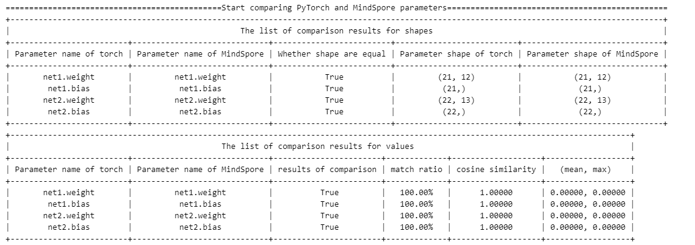

# troubleshooter.migrator.NetDifferenceFinder

> ## *Class*  troubleshooter.migrator.NetDifferenceFinder(pt_net, ms_net, print_level=1, **kwargs)

### 参数：

- pt_net(`torch.nn.Module`): torch模型实例
- ms_net(`mindspore.nn.Cell`): MindSpore模型实例
- print_level(int): 日志打印等级，默认值为1。

### kwargs参数：

- pt_params_path(`str`, 可选): torch模型参数文件路径
- ms_params_path(`str`, 可选): MindSpore模型参数文件路径
- auto_conv_ckpt(`int`, 可选): 权重自动转换方式，默认值为1。为0时，不进行权重转换；为1时为PyTorch权重转换到MindSpore；为2时为PyTorch权重转换到MSAdapter。
- compare_params(`bool`, 可选): 是否开启网络参数对比，默认值为True。开启时，会使用PyTorch的保存的pth和MindSpore保存的ckpt进行比较，以校验网络结构。
> **说明：**
> 1. 默认参数下，会将PyTorch网络的权重保存、转换并加载MindSpore网络中，以保证两边的模型权重初始化一致。除此以外，还会将PyTorch的权重文件和MindSpore网络自身保存的权重文件进行比对，以校验网络结构。
> 2. 当同时传入`pt_params_path`和`ms_params_path`时，会从文件中加载权重执行正向推理（`auto_conv_ckpt`会失效），不会进行权重转换;
> 3. 当前仅支持权重从PyTorch转换到MindSpore，当传入`ms_params_path`，`pt_params_path`为空时，需要将`auto_conv_ckpt`设置为0，并自己保证权重初始化一致；

## troubleshooter.migrator.NetDifferenceFinder.compare
>  troubleshooter.migrator.NetDifferenceFinder.compare(inputs=None, auto_inputs=None, **kwargs)

### 参数列表

| 参数        | 类型                                                         | 说明                                                         |
| ----------- | ------------------------------------------------------------ | ------------------------------------------------------------ |
| inputs      | 单输入：`Union(tuple[torch.tensor], tuple[mindspore.Tensor], tuple[numpy.ndarray], tuple[str])`；多输入：`list[Union(tuple[torch.tensor], tuple[mindspore.Tensor], tuple[numpy.ndarray], tuple[str])]` | 模型输入。模型输入支持`torch.Tensor`, `mindspore.Tensor`, `np.ndarray`以及`str`，每个`tuple`中包含一个模型输入；当用户想要同时验证多组数据时，请使用一个列表存放所有输入。 |
| auto_inputs | 单输入：`tuple[tuple[numpy.shape, numpy.dtype]]`；多输入：`{'input': tuple[tuple[numpy.shape, numpy.dtype]], 'num':int}` | 默认为`None`，为了方便用户快速验证。用户可以不输入`inputs`，而是输入`auto_inputs`，`auto_inputs`每一个元素为模型输入的`shape`，如果需要使用多次测试，可以传入一个字典，字典的键为`'input'`和`'num'`，分别表示每次的输入以及输入个数 |
| rtol        | `float`                                                      | 相对误差，默认值为`1e-4`，内部调用`numpy.allclose`的参数。   |
| atol        | `float`                                                      | 绝对误差，默认值为`1e-4`，内部调用`numpy.allclose`的参数。   |
| equal_nan   | `bool`                                                       | 是否将nan视为相等，默认值为 `False`，内部调用`numpy.allclose`的参数。 |

# 如何使用

可以参考[test_netdifffinder.py](https://gitee.com/mindspore/toolkits/blob/master/tests/st/troubleshooter/diff_handler/test_netdifffinder.py)中的使用方法，以下为伪代码：

```python
pt_net = ConstTorch()
ms_net = ConstMS()
diff_finder = ts.migrator.NetDifferenceFinder(
    pt_net=pt_net,
    ms_net=ms_net)
diff_finder.compare(auto_inputs=(((1, 12), np.float32), ))
```

输出结果：
默认参数下，输出主要包含权重转换（当auto_conv_ckpt为2，对应MSAdapter模式时，由于权重一致，因此没有此过程）、PyTorch和MindSpore的权重比较、网络推理三部分。

**权重转换**

此过程会将输入的PyTorch网络自动保存pth文件，并转换为MindSpore的ckpt文件。转换中会显示转换详情。

**权重比较**

在权重转换之后，会将转换后的ckpt加载到MindSpore的网络中。为确认两边模型参数一致，此过程会将加载后网络保存的ckpt和PyTorch的pth文件进行比较，包括shape和value两部分。


**网络推理**

最后会执行网络推理。此过程会固定随机性，并将PyTorch的网络设置为`eval`模式，MindSpore设置`set_train(False)`。将构造的数据分别输入到两个网络中执行前向推理，获得对应结果，最后比较结果的差异。


> **提示：**
> 对于MindSpore和PyTorch模型不在同一个项目中的情况，无法直接比较网络输出，可以使用`sys.path.insert(0, path)`来把模型所在的项目加入系统路径，然后实例化模型比较。例如：
> ```python
> import sys
> sys.path.insert(0, "path to your mindspore model define project")
> sys.path.insert(0, "path to your pytorch model define project")
> from xxx import TorchNet
> from xxx import MSNet
> pt_net = TorchNet()
> ms_net = MSNet()
> diff_finder = ts.migrator.NetDifferenceFinder(
>  pt_net=pt_net,
>  ms_net=ms_net)
> diff_finder.compare(auto_inputs=(((1, 12), np.float32), ))
> ```
