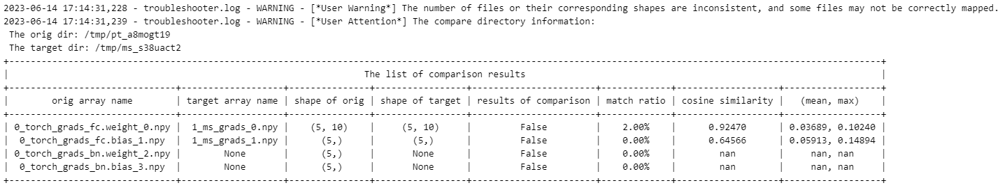

## troubleshooter.migrator.compare_grads_dir

> troubleshooter.migrator.compare_grads_dir(orig_dir, target_dir, rtol=1e-4, atol=1e-4, equal_nan=False, *, name_map_list=None)

批量对比两个目录下使用ts.save保存梯度得到的npy文件。和compare_npy_dir类似，同样会计算`numpy.allclose`、`allclose`达标比例、余弦相似度、差异值的 $mean$ / $max$ 统计量等信息，除此之外，还会显示梯度的shape信息。

> **说明：**
>
> 1. 目前MindSpore获取的梯度不包含名称信息，在一些情况下，两边的网络结构可能不完全相同，按照顺序匹配会导致很多文件匹配失败。梯度比较的匹配策略是根据shape计算最小[编辑距离](https://baike.baidu.com/item/%E7%BC%96%E8%BE%91%E8%B7%9D%E7%A6%BB/8010193)，其中删除、插入代价为1，替换代价为5。如果需要调整代价可以直接调用`get_name_map_list_by_shape_edit_distance`函数，在获取`name_map_list`后直接传入`compare_grads_dir`。
>
> 2. torch的梯度需要通过`ts.widget.get_pt_grads`获取，如样例所示。

### 参数：

- orig_dir: 需要对比的npy文件所在的目录。
- target_dir: 目标数据所在的目录。
- rtol: 相对误差，默认值为`1e-4`，内部调用`numpy.allclose`的参数。
- atol: 绝对误差，默认值为`1e-4`，内部调用`numpy.allclose`的参数。
- equal_nan：是否将nan视为相等，默认值为 `False`，内部调用`numpy.allclose`的参数。
- name_map_list: 自定义文件名映射列表，默认值为`None`。当需要指定源目录与目标目录的文件映射方式时，可以使用此参数。此参数类型为list[tuple[ori_file, target_file]]，例如`[(ms_file_0.npy, torch_file_0.npy),...]`

### 样例：

```python
import os
import shutil
import numpy as np
import troubleshooter as ts
import torch
import mindspore as ms
import tempfile
class PtSimpleNet(torch.nn.Module):
    def __init__(self):
        super(PtSimpleNet, self).__init__()
        self.fc = torch.nn.Linear(10, 5)
        self.bn = torch.nn.BatchNorm1d(5)
    def forward(self, x):
        return self.bn(self.fc(x))

class MsSimpleNet(ms.nn.Cell):
    def __init__(self):
        super(MsSimpleNet, self).__init__()
        self.fc = ms.nn.Dense(10, 5)
    def construct(self, x):
        return self.fc(x)

pt_outpath = tempfile.mkdtemp(prefix="pt_")
ms_outpath = tempfile.mkdtemp(prefix="ms_")
inputs = np.random.randn(32, 10).astype(np.float32)
targets = np.random.randn(32, 5).astype(np.float32)

pt_net = PtSimpleNet()
pt_criterion = torch.nn.MSELoss()
pt_optimizer = torch.optim.SGD(pt_net.parameters(), lr=0.01)
pt_outputs = pt_net(torch.tensor(inputs))
pt_loss = pt_criterion(pt_outputs, torch.tensor(targets))
pt_optimizer.zero_grad()
pt_loss.backward()
# use ts.widget.get_pt_grads get torch grads
pt_grads = ts.widget.get_pt_grads(pt_net)
ts.save(os.path.join(pt_outpath, "torch_grads"), pt_grads)

ms_net = MsSimpleNet()
ms_loss_fn = ms.nn.MSELoss()

def forward_fn(inputs, targets):
    out = ms_net(inputs)
    loss = ms_loss_fn(out, targets)
    return loss

grad_fn = ms.value_and_grad(forward_fn, None, ms_net.trainable_params())
ms_loss, ms_grads = grad_fn(ms.Tensor(inputs), ms.Tensor(targets))
ts.save(os.path.join(ms_outpath, "ms_grads"), ms_grads)
ts.migrator.compare_grads_dir(pt_outpath, ms_outpath)
shutil.rmtree(pt_outpath)
shutil.rmtree(ms_outpath)
```

### 结果：



