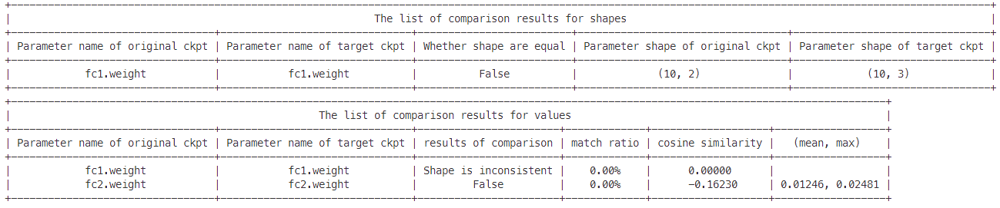

## troubleshooter.migrator.compare_ms_ckpt

> troubleshooter.migrator.compare_ms_ckpt(orig_file_path, target_file_path, **kwargs)

用于比较两个MindSpore的ckpt的结构和数值的差异。

### 常用参数：

- orig_file_path(str)：原始的ckpt的路径。
- target_file_path(str)：目标ckpt的路径。

### kwargs参数

- compare_value(bool)：是否进行数值比较，默认值为True。为True时，会分别输出shape和value两个差异分析表格。
- print_level(int)：日志等级，默认值为1。为0时不输出比较结果，为1时输出所有结果，为2时仅输出有差异的结果。
- rtol(float): 开启数值比较时的比较参数，相对误差，默认值为`1e-4`，内部调用`numpy.allclose`的参数。
- atol(float): 开启数值比较时的比较参数，绝对误差，默认值为`1e-4`，内部调用`numpy.allclose`的参数。
- equal_nan(bool)：开启数值比较时的比较参数，是否将nan视为相等，默认值为 `False`，内部调用`numpy.allclose`的参数。

### 样例

```python
import troubleshooter as ts
import mindspore as ms
from mindspore import nn


class NetA(nn.Cell):
    def __init__(self):
        super(NetA, self).__init__()
        self.fc1 = nn.Dense(2, 10)
        self.bn1 = nn.BatchNorm1d(10)
        self.fc2 = nn.Dense(10, 1)
        self.relu = nn.ReLU()
        self.sigmoid = nn.Sigmoid()

    def construct(self, x):
        x = self.relu(self.bn1(self.fc1(x)))
        x = self.sigmoid(self.fc2(x))
        return x

class NetB(nn.Cell):
    def __init__(self):
        super(NetB, self).__init__()
        self.fc1 = nn.Dense(3, 10)
        self.bn1 = nn.BatchNorm1d(10)
        self.fc2 = nn.Dense(10, 1)
        self.relu = nn.ReLU()
        self.sigmoid = nn.Sigmoid()
        

    def construct(self, x):
        x = self.relu(self.bn1(self.fc1(x)))
        x = self.sigmoid(self.fc2(x))
        return x

net_0 = NetA()
net_1 = NetB()
ms.save_checkpoint(net_0, "net_a.ckpt")
ms.save_checkpoint(net_1, "net_b.ckpt")
```

```python
# Comparing all
ts.migrator.compare_ms_ckpt("net_a.ckpt", "net_b.ckpt")
```


```python
# Comparing all, only print difference
ts.migrator.compare_ms_ckpt("net_a.ckpt", "net_b.ckpt", print_level=2)
```



```python
# Comparing network parameter structures, only print difference
ts.migrator.compare_ms_ckpt("net_a.ckpt", "net_b.ckpt", compare_value=False, print_level=2)
```


