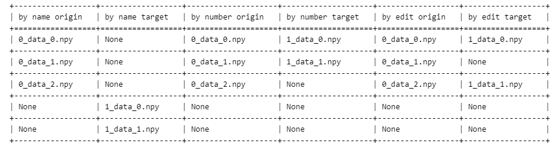

## troubleshooter.migrator.compare_npy_dir

> troubleshooter.migrator.compare_npy_dir(orig_dir, target_dir, rtol=1e-4, atol=1e-4, equal_nan=False, *, name_map_list=None, compare_shape=False, output_file=None)

批量对比两个目录下的npy文件。

会计算`numpy.allclose`、`allclose`达标比例、余弦相似度、差异值的 $mean$ / $max$ 统计量等信息，如果两个目录下名称不完全相同，可以通过指定`name_map_list`来自定义规则。

默认会比较两个目录下的名称完全相同的npy文件，未匹配的文件会显示None，如果需要自定义文件匹配规则，需要指定匹配列表`name_map_list`。

### 参数

- orig_dir(`str`): 需要对比的npy文件所在的目录。
- target_dir(`str`): 目标数据所在的目录。
- rtol(`float`): 相对误差，默认值为`1e-4`，内部调用`numpy.allclose`的参数。
- atol(`float`): 绝对误差，默认值为`1e-4`，内部调用`numpy.allclose`的参数。
- equal_nan(`bool`): 是否将nan视为相等，默认值为 `False`，内部调用`numpy.allclose`的参数。
- name_map_list(`list[tuple[str, str]]`): 自定义文件名映射列表，默认值为`None`。当需要指定源目录与目标目录的文件映射方式时，可以使用此参数。此参数类型为list[tuple[ori_file, target_file]]，例如`[(ms_file_0.npy, torch_file_0.npy),...]`
- compare_shape(`bool`): 是否比较shape信息，默认值`False`。
- output_file(`str`): 比较结果导出为csv文件的路径，默认值`None`，推荐使用绝对路径。
- num_processes(`int`): 比较结果时的进程数，默认值`None`，将设置为8和CPU核心数-1的最小值。

### 样例

以下示例使用`troubleshooter.save`接口进行数据保存，之后使用`compare_npy_dir`进行数据对比。

文件匹配规则使用数字升序匹配，详情请参考[`get_name_map_list_by_number`](https://gitee.com/mindspore/toolkits/blob/master/troubleshooter/docs/api/migrator/get_name_map_list.md#troubleshootermigratorget_name_map_list_by_number)

```python
import troubleshooter as ts
import os
import tempfile
import mindspore as ms

data1 = ms.ops.randn((2,3))
data2 = ms.ops.randn((3,5))
cache_dir1 = tempfile.TemporaryDirectory(prefix='ta')
cache_dir2 = tempfile.TemporaryDirectory(prefix='tb')
path1 = cache_dir1.name
path2 = cache_dir2.name

ts.save(os.path.join(path1, 'data'), [data1, data2])
ts.save(os.path.join(path2, 'data'), [data1, data1])
# Use matching in numerical order
name_map = ts.migrator.get_name_map_list_by_number(path1, path2)
ts.migrator.compare_npy_dir(path1, path2, name_map_list=name_map)

```

**结果：**

自左至右分别为源文件名、目标文件名、`allclose`的比较结果、`allclose`的达标比例（符合`allclose`的数据占总数据的百分比）、余弦相似度、差异值的 $mean$ / $max$ 统计量。

```bash
2023-11-16 11:32:33,882 - troubleshooter.log - WARNING - [*User Attention*] The compare directory information:
 The orig dir: /tmp/ta9553n79z 
 The target dir: /tmp/tb07pjiank
100%|███████████████████████████████████████████████████████████████████████████████████████████████████| 2/2 [00:06<00:00,  3.21s/it]
+------------------------------------------------------------------------------------------------------------------------+
|                                             The list of comparison results                                             |
+-----------------+-------------------+-----------------------+-------------------+-------------------+------------------+
| orig array name | target array name |   result of allclose  | ratio of allclose | cosine similarity | mean & max diffs |
+-----------------+-------------------+-----------------------+-------------------+-------------------+------------------+
|   0_data_0.npy  |    1_data_0.npy   |          True         |      100.00%      |      1.00000      | 0.00000, 0.00000 |
|   0_data_1.npy  |    1_data_1.npy   | Shape is inconsistent |       0.00%       |        nan        |     nan, nan     |
+-----------------+-------------------+-----------------------+-------------------+-------------------+------------------+
```

> **提示：**
>
> 在一些场景下，比较的文件名称可能并不完全相同，默认匹配效果较差。比较算法支持传入自定义匹配规则，为方便获取文件的映射结果，`TroubleShooter`提供了多种匹配策略获取`name_map_list`，以下做简单介绍，具体可查看[get_name_map_list](`https://gitee.com/mindspore/toolkits/blob/master/troubleshooter/docs/api/migrator/get_name_map_list.md)。
>
> - `get_name_map_list_by_name(orig_dir, target_dir)`：名称完全一致时匹配；
>
> - `get_name_map_list_by_number(orig_dir, target_dir)`：按照文件名中的数字升序后顺序配对；
>
> - `get_name_map_list_by_shape_edit_distance(orig_dir, target_dir, *, del_cost=1, ins_cost=1, rep_cost=5)`：按照文件名中的数字排序后，根据shape信息计算最小编辑距离计算进行匹配。常用于结构不完全一致时的比较，例如梯度比较。
>
> 以下为使用`ts.save`对不等长的数据进行连续保存，分别使用三种不同匹配算法获得的匹配效果。
>
> ```python
> data0 = mindspore.ops.randn((2,3))
> data1 = mindspore.ops.randn((3,5))
> data2 = mindspore.ops.randn((5,5))
> path1 = tempfile.mkdtemp(prefix='ta')
> path2 = tempfile.mkdtemp(prefix='tb')
>
> ts.save(os.path.join(path1, 'data'), [data0, data1, data2])
> ts.save(os.path.join(path2, 'data'), [data0, data2])
>
> by_name = ts.migrator.get_name_map_list_by_name(path1, path2)
> by_number = ts.migrator.get_name_map_list_by_number(path1, path2)
> by_edit_shape = ts.migrator.get_name_map_list_by_shape_edit_distance(path1, path2)
> ```
>
> 
