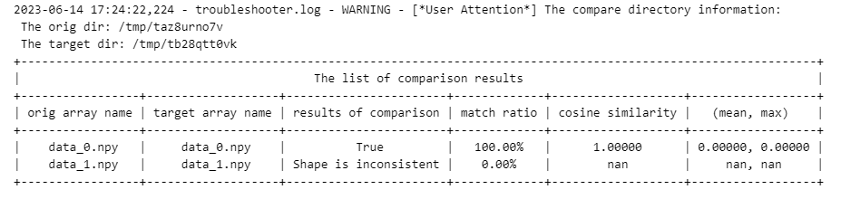

## troubleshooter.migrator.compare_npy_dir

> troubleshooter.migrator.compare_npy_dir(orig_dir, target_dir, rtol=1e-4, atol=1e-4, equal_nan=False, *, name_map_list=None, compare_shape=False, output_file=None)

批量对比两个目录下名称**完全相同**的npy文件。

会计算`numpy.allclose`、`allclose`达标比例、余弦相似度、差异值的 $mean$ / $max$ 统计量等信息，如果两个目录下名称不完全相同，可以通过指定`name_map_list`来自定义规则。

### 参数

- orig_dir(`str`): 需要对比的npy文件所在的目录。
- target_dir(`str`): 目标数据所在的目录。
- rtol(`float`): 相对误差，默认值为`1e-4`，内部调用`numpy.allclose`的参数。
- atol(`float`): 绝对误差，默认值为`1e-4`，内部调用`numpy.allclose`的参数。
- equal_nan(`bool`): 是否将nan视为相等，默认值为 `False`，内部调用`numpy.allclose`的参数。
- name_map_list(`list[tuple[str, str]]`): 自定义文件名映射列表，默认值为`None`。当需要指定源目录与目标目录的文件映射方式时，可以使用此参数。此参数类型为list[tuple[ori_file, target_file]]，例如`[(ms_file_0.npy, torch_file_0.npy),...]`
- compare_shape(`bool`): 是否比较shape信息，默认值`False`。
- output_file(`str`): 比较结果导出为csv文件的路径，默认值`None`。

### 样例

```python
import os
import shutil
import tempfile
import mindspore as ms

data1 = ms.ops.randn((2,3))
data2 = ms.ops.randn((3,5))
path1 = tempfile.mkdtemp(prefix='ta')
path2 = tempfile.mkdtemp(prefix='tb')

ts.save(os.path.join(path1, 'data'), [data1, data2], auto_id=False)
ts.save(os.path.join(path2, 'data'), [data1, data1], auto_id=False)
ts.migrator.compare_npy_dir(path1, path2)

shutil.rmtree(path1)
shutil.rmtree(path2)
```

**结果：**

自左至右分别为源文件名、目标文件名、`allclose`的比较结果、`allclose`的达标比例（符合`allclose`的数据占总数据的百分比）、余弦相似度、差异值的 $mean$ / $max$ 统计量。
