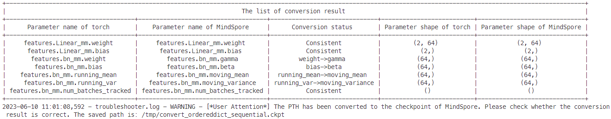
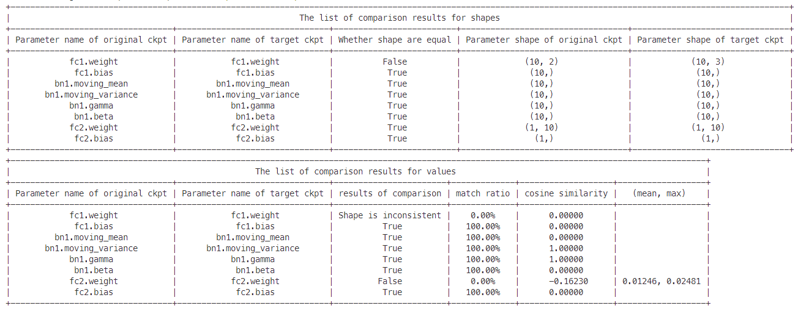
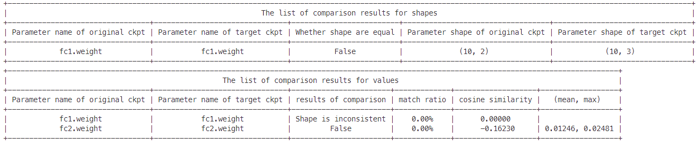
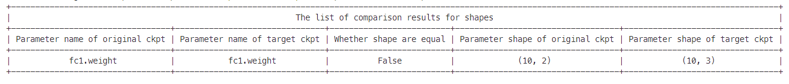
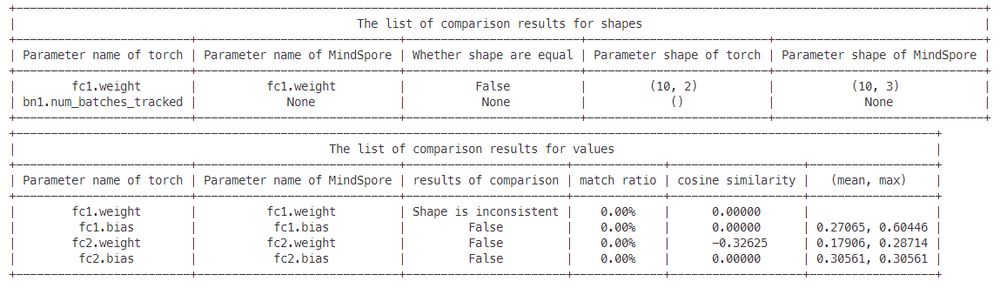
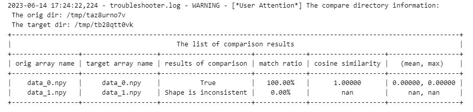
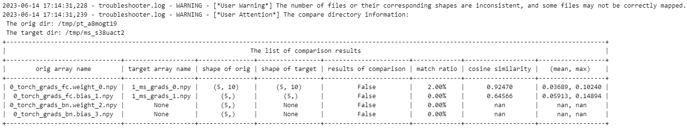

# 网络迁移&调试-使用迁移功能快速迁移网络

## 应用场景1：pth到ckpt权重自动转换
用户需要从PyTorch网络迁移到MindSpore网络时，需要进行权重迁移，因为MindSpore的权重名称与Pytorch有差异，需要使用权重迁移工具进行权重自动化迁移。
### 结果展示
显示转换后的ckpt保存路径与名称，并给出详细的转换信息。


### 如何使用1-网络结构完全一致，权重自动转换
在MindSpore迁移后的网络结构与PyTorch网络结构完全一致时，pth到ckpt转换，仅有权重名称差异，则可以通过如下方法完成权重的自动转换。
```python
import troubleshooter as ts

torch_net = resnet50(num_classes=10)
pth_path="./resnet.pth"

"""
pt_model：PyTorch网络实例；
weight_map_save_path：转换后的权重映射表路径；
print_map: 是否打印映射表。
"""
ts.migrator.get_weight_map(pt_model=torch_net,
                           weight_map_save_path="/tmp/torch_net_map.json",
                           print_map=True)
"""
weight_map_path: get_weight_map生成的权重映射表路径；
pt_file_path: PyTorch的pth文件路径。支持模型（例如：torch.save(torch_net, "torch_net.pth") ）和
参数（例如：torch.save(torch_net.state_dict(), "torch_net.pth"), 两种形式pth文件的自动加载。
如果保存的pth文件内容经过定制，不能进行自动加载，可使用"pth_para_dict"直接传入加载并解析后的权重参数字典；
ms_file_save_path: 转换后的MindSpore的ckpt文件路径。
"""
ts.migrator.convert_weight(weight_map_path="/tmp/torch_net_map.json",
                           pt_file_path="/tmp/torch_net.pth",
                           ms_file_save_path='/tmp/convert_resnet.ckpt')
```
### 如何使用2-网络结构有一定差异，需要定制权重名称前缀

```python
import troubleshooter as ts

# PyTorch的resnet50网络
torch_net = resnet50(num_classes=10)
pth_path="./resnet.pth"

# weight_name_prefix：需要添加的权重前缀
ts.migrator.get_weight_map(pt_model=torch_net,
                           weight_map_save_path="/tmp/torch_net_map.json",
                           weight_name_prefix='uvp',
                           print_map=True)
# 调用转换接口
ts.migrator.convert_weight(weight_map_path="/tmp/torch_net_map.json",
                           pt_file_path="/tmp/torch_net.pth",
                           ms_file_save_path='/tmp/convert_resnet.ckpt')
```

### 如何使用3-网络结构有一定差异，需要对权重名称做复杂的定制转换
在MindSpore迁移后的网络结构与PyTorch网络结构不完全一致时，需要用户手工定义转换规则，此时工具提供了定制接口，满足此种场景下用户的定制诉求。

```python
import troubleshooter as ts

def custorm_weight_name(weight_name_map):
    prefix='.custorm.'
    custorm_name_map = {}
    for key, value in weight_name_map.items():
        index = value.find(".")
        value = value[0:index] + prefix + value[index+1:]
        print(key, ":", value)
        custorm_name_map[key] = str(value)
    return custorm_name_map

# PyTorch的resnet50网络
torch_net = resnet50(num_classes=10)
pth_path="./resnet.pth"

"""
custom_name_func: 可封装定制函数，例如：custorm_weight_name，完成映射关系的定制
"""
ts.migrator.get_weight_map(pt_model=torch_net,
                           weight_map_save_path="/tmp/torch_net_map.json",
                           custom_name_func=custorm_weight_name,
                           print_map=True)

# 调用转换接口
ts.migrator.convert_weight(weight_map_path="/tmp/torch_net_map.json",
                           pt_file_path="/tmp/torch_net.pth",
                           ms_file_save_path='/tmp/convert_resnet.ckpt')

# 执行结果：根据定制所有参数名称增加一个层custorm ，执行后举例: features.Linear_mm.weight 参数名称将转换为
# features.custorm.Linear_mm.weight
```


## 应用场景2：比对MindSpore与PyTorch的ckpt/pth

1. 在迁移网络到MindSpore后，为检验网络结构是否相同，我们可以保存迁移后网络生产的ckpt与转换的ckpt（用权重转换工具从pth转换过来的ckpt）进行结构对比，以验证网络结构的正确性。
2. 在迁移网络训练中，在固定随机性后，如果网络输出的第一个loss相同，之后的loss不一致，可以分别保存ckpt与pth，通过比较ckpt与pth的对应参数的值来检验网络反向更新的结果。

### 接口定义：

#### ```compare_ms_ckpt(orig_file_path, target_file_path, **kwargs)```

用于比较两个MindSpore的ckpt的结构和数值的差异。

**位置参数：**

- orig_file_path(str)：原始的ckpt的路径。
- target_file_path(str)：目标ckpt的路径。

**kwargs参数：**

- compare_value(bool)：是否进行数值比较，默认值为True。为True时，会分别输出shape和value两个差异分析表格。
- print_level(int)：日志等级，默认值为1。为0时不输出比较结果，为1时输出所有结果，为2时仅输出有差异的结果。
- rtol(float): 开启数值比较时的比较参数，相对误差，默认值为`1e-4`，内部调用`numpy.allclose`的参数。
- atol(float): 开启数值比较时的比较参数，绝对误差，默认值为`1e-4`，内部调用`numpy.allclose`的参数。
- equal_nan(bool)：开启数值比较时的比较参数，是否将nan视为相等，默认值为 `False`，内部调用`numpy.allclose`的参数。

**样例：**
```python
import troubleshooter as ts
import mindspore as ms
from mindspore import nn


class NetA(nn.Cell):
    def __init__(self):
        super(NetA, self).__init__()
        self.fc1 = nn.Dense(2, 10)
        self.bn1 = nn.BatchNorm1d(10)
        self.fc2 = nn.Dense(10, 1)
        self.relu = nn.ReLU()
        self.sigmoid = nn.Sigmoid()

    def construct(self, x):
        x = self.relu(self.bn1(self.fc1(x)))
        x = self.sigmoid(self.fc2(x))
        return x

class NetB(nn.Cell):
    def __init__(self):
        super(NetB, self).__init__()
        self.fc1 = nn.Dense(3, 10)
        self.bn1 = nn.BatchNorm1d(10)
        self.fc2 = nn.Dense(10, 1)
        self.relu = nn.ReLU()
        self.sigmoid = nn.Sigmoid()
        

    def construct(self, x):
        x = self.relu(self.bn1(self.fc1(x)))
        x = self.sigmoid(self.fc2(x))
        return x

net_0 = NetA()
net_1 = NetB()
ms.save_checkpoint(net_0, "net_a.ckpt")
ms.save_checkpoint(net_1, "net_b.ckpt")
```

```python
# Comparing all
ts.migrator.compare_ms_ckpt("net_a.ckpt", "net_b.ckpt")
```

```python
# Comparing all, only print difference
ts.migrator.compare_ms_ckpt("net_a.ckpt", "net_b.ckpt", print_level=2)
```

```python
# Comparing network parameter structures, only print difference
ts.migrator.compare_ms_ckpt("net_a.ckpt", "net_b.ckpt", compare_value=False, print_level=2)
```



#### ```compare_pth_and_ckpt(weight_map_path, pt_file_path, ms_file_path, **kwargs)```

用于比较PyTorch和MindSpore的结构和数值差异。

**位置参数：**
- weight_map_path(str)：通过get_weight_map函数生成的权重映射表路径。
- pt_file_path(str)：PyTorch的pth文件路径。
- ms_file_path(str)：MindSpore的ckpt的文件路径。

**kwargs参数：**

- compare_value(bool)：是否进行数值比较，默认值为True。为True时，会分别输出shape和value两个差异分析表格。
- print_level(int)：日志等级，默认值为1。为0时不输出比较结果，为1时输出所有结果，为2时仅输出有差异的结果。
- rtol(float): 开启数值比较时的比较参数，相对误差，默认值为`1e-4`，内部调用`numpy.allclose`的参数。
- atol(float): 开启数值比较时的比较参数，绝对误差，默认值为`1e-4`，内部调用`numpy.allclose`的参数。
- equal_nan(bool)：开启数值比较时的比较参数，是否将nan视为相等，默认值为 `False`，内部调用`numpy.allclose`的参数。

**样例：**
```python
import troubleshooter as ts
import torch
import mindspore as ms
from mindspore import nn


class PTNet(torch.nn.Module):
    def __init__(self):
        super(PTNet, self).__init__()
        self.fc1 = torch.nn.Linear(2, 10)
        self.bn1 = torch.nn.BatchNorm1d(10)
        self.fc2 = torch.nn.Linear(10, 1)
        self.relu = torch.nn.ReLU()
        self.sigmoid = torch.nn.Sigmoid()

    def construct(self, x):
        x = self.relu(self.bn1(self.fc1(x)))
        x = self.sigmoid(self.fc2(x))
        return x

class MSNet(nn.Cell):
    def __init__(self):
        super(MSNet, self).__init__()
        self.fc1 = nn.Dense(3, 10)
        self.bn1 = nn.BatchNorm1d(10)
        self.fc2 = nn.Dense(10, 1)
        self.relu = nn.ReLU()
        self.sigmoid = nn.Sigmoid()

    def construct(self, x):
        x = self.relu(self.bn1(self.fc1(x)))
        x = self.sigmoid(self.fc2(x))
        return x

pt_net = PTNet()
ms_net = MSNet()
ts.migrator.get_weight_map(pt_model=pt_net,
                           weight_map_save_path="torch_net_map.json")
torch.save(pt_net.state_dict(), "pt_net.pth")
ms.save_checkpoint(ms_net, "ms_net.ckpt")
ts.migrator.compare_pth_and_ckpt("torch_net_map.json", "pt_net.pth", "ms_net.ckpt", print_level=2)
```


## 应用场景3：保存tensor
在网络迁移精度问题排查时，需要对网络中的数据进行保存。`troubleshooter`提供了支持`MindSpore`和`PyTorch`的统一数据保存接口，并支持文件自动编号功能。

### 接口定义

#### ```save(file:str, data:Union(Tensor, list[Tensor], tuple[Tensor], dict[str, Tensor], auto_id=True, suffix=None))```

- file: 文件名路径。当`file`为`None`或`''`时，文件名会自动设置为`tensor_(shape)`，文件路径为当前路径。
- data: 数据，支持保存`Tensor`（包括`mindspore.Tensor`和`pytorch.tensor`），以及`Tensor`构成的`list/tuple/dict`。当为`list/tuple`类型时，会按照顺序添加编号；当为`dict`类型时，文件名中会添加`key`。
- auto_id: 自动编号，默认值为`True`。当为`True`时，保存时会自动为文件添加全局编号，编号从0开始。
- suffix: 文件名后缀，默认值为`None`。

**文件保存格式**

存储的文件名称为 `{id}_name_{idx/key}_{suffix}.npy`

### 如何使用

**支持MindSpore动态图和静态图**

```python
import os
import shutil

import troubleshooter as ts
import mindspore as ms
from mindspore import nn, Tensor

class NetWorkSave(nn.Cell):
    def __init__(self, file):
        super(NetWorkSave, self).__init__()
        self.file = file

    def construct(self, x):
        ts.save(self.file, x)
        return x

x1 = Tensor(-0.5962, ms.float32)
x2 = Tensor(0.4985, ms.float32)
try:
    shutil.rmtree("/tmp/save/")
except FileNotFoundError:
    pass
os.makedirs("/tmp/save/")
net = NetWorkSave('/tmp/save/ms_tensor')

# 支持自动编号
out1 = net(x1)
# /tmp/save/0_ms_tensor.npy

out2 = net(x2)
# /tmp/save/1_ms_tensor.npy

out3 = net([x1, x2])
# /tmp/save/2_ms_tensor_0.npy
# /tmp/save/2_ms_tensor_1.npy

out4 = net({"x1": x1, "x2":x2})
# /tmp/save/3_ms_tensor_x1.npy
# /tmp/save/3_ms_tensor_x2.npy
```

**支持PyTorch**

```python
import os
import shutil

import troubleshooter as ts
import torch
x1 = torch.tensor([-0.5962, 0.3123], dtype=torch.float32)
x2 = torch.tensor([[0.4985],[0.4323]], dtype=torch.float32)

try:
    shutil.rmtree("/tmp/save/")
except FileNotFoundError:
    pass
os.makedirs("/tmp/save/")

file = '/tmp/save/torch_tensor'

ts.save(file, x1)
# /tmp/save/0_torch_tensor.npy
ts.save(file, x2)
# /tmp/save/1_torch_tensor.npy
ts.save(None, {"x1":x1, "x2":x2}, suffix="torch")
# ./2_tensor_(2,)_x1_torch.npy
# ./2_tensor_(2, 1)_x2_torch.npy
```

## 应用场景4：比较两组tensor值(npy文件)是否相等
进行网络迁移精度问题排查等场景，需要获取网络中的tensor或者梯度等数据进行比较。TroubleShooter提供了批量对比两个目录下npy文件的功能。

### 接口定义
#### ```compare_npy_dir(orig_dir, target_dir, rtol=1e-4, atol=1e-4, equal_nan=False, *, name_map_list=None)```
批量对比两个目录下名称**完全相同**的npy文件。会计算`numpy.allclose`、`allclose`达标比例、余弦相似度、差异值的 $mean$ / $max$ 统计量等信息，如果两个目录下名称不完全相同，可以通过指定`name_map_list`来自定义规则。

**参数：**
- orig_dir: 需要对比的npy文件所在的目录。
- target_dir: 目标数据所在的目录。
- rtol: 相对误差，默认值为`1e-4`，内部调用`numpy.allclose`的参数。
- atol: 绝对误差，默认值为`1e-4`，内部调用`numpy.allclose`的参数。
- equal_nan：是否将nan视为相等，默认值为 `False`，内部调用`numpy.allclose`的参数。
- name_map_list: 自定义文件名映射列表，默认值为`None`。当需要指定源目录与目标目录的文件映射方式时，可以使用此参数。此参数类型为list[tuple[ori_file, target_file]]，例如`[(ms_file_0.npy, torch_file_0.npy),...]`

**样例：**
```python
import os
import shutil
import tempfile
import mindspore as ms

data1 = ms.ops.randn((2,3))
data2 = ms.ops.randn((3,5))
path1 = tempfile.mkdtemp(prefix='ta')
path2 = tempfile.mkdtemp(prefix='tb')

ts.save(os.path.join(path1, 'data'), [data1, data2], auto_id=False)
ts.save(os.path.join(path2, 'data'), [data1, data1], auto_id=False)
ts.migrator.compare_npy_dir(path1, path2)

shutil.rmtree(path1)
shutil.rmtree(path2)
```
**结果：**

自左至右分别为源文件名、目标文件名、`allclose`的比较结果、`allclose`的达标比例（符合`allclose`的数据占总数据的百分比）、余弦相似度、差异值的 $mean$ / $max$ 统计量。


> **提示：**
>
> 为方便获取文件的映射结果，TroubleShooter提供了多种策略函数获取`name_map_list`。
>
> - `get_name_map_list_by_name(orig_dir, target_dir)`：名称完全一致时匹配；
>
> - `get_name_map_list_by_number(orig_dir, target_dir)`：按照文件名中的数字升序后顺序配对；
>
> - `get_name_map_list_by_shape_edit_distance(orig_dir, target_dir, *, del_cost=1, ins_cost=1, rep_cost=5)`：按照文件名中的数字排序后，根据shape信息计算最小编辑距离计算进行匹配。常用于结构不完全一致时的比较，例如梯度比较。
> 
> 以下为使用`ts.save`对不等长的数据进行连续保存，分别使用三种不同匹配算法获得的匹配效果。
> ```python
> data0 = mindspore.ops.randn((2,3))
> data1 = mindspore.ops.randn((3,5))
> data2 = mindspore.ops.randn((5,5))
> path1 = tempfile.mkdtemp(prefix='ta')
> path2 = tempfile.mkdtemp(prefix='tb')
>
> ts.save(os.path.join(path1, 'data'), [data0, data1, data2])
> ts.save(os.path.join(path2, 'data'), [data0, data2])
>
> by_name = ts.migrator.get_name_map_list_by_name(path1, path2)
> by_number = ts.migrator.get_name_map_list_by_number(path1, path2)
> by_edit_shape = ts.migrator.get_name_map_list_by_shape_edit_distance(path1, path2)
> ```
> 


#### ```compare_grads_dir(orig_dir, target_dir, rtol=1e-4, atol=1e-4, equal_nan=False, *, name_map_list=None)```
批量对比两个目录下使用ts.save保存梯度得到的npy文件。和compare_npy_dir类似，同样会计算`numpy.allclose`、`allclose`达标比例、余弦相似度、差异值的 $mean$ / $max$ 统计量等信息，除此之外，还会显示梯度的shape信息。

> **说明：**
>
> 1. 目前MindSpore获取的梯度不包含名称信息，在一些情况下，两边的网络结构可能不完全相同，按照顺序匹配会导致很多文件匹配失败。梯度比较的匹配策略是根据shape计算最小[编辑距离](https://baike.baidu.com/item/%E7%BC%96%E8%BE%91%E8%B7%9D%E7%A6%BB/8010193)，其中删除、插入代价为1，替换代价为5。如果需要调整代价可以直接调用`get_name_map_list_by_shape_edit_distance`函数，在获取`name_map_list`后直接传入`compare_grads_dir`。
>
> 2. torch的梯度需要通过`ts.widget.get_pt_grads`获取，如样例所示。

**参数：**
- orig_dir: 需要对比的npy文件所在的目录。
- target_dir: 目标数据所在的目录。
- rtol: 相对误差，默认值为`1e-4`，内部调用`numpy.allclose`的参数。
- atol: 绝对误差，默认值为`1e-4`，内部调用`numpy.allclose`的参数。
- equal_nan：是否将nan视为相等，默认值为 `False`，内部调用`numpy.allclose`的参数。
- name_map_list: 自定义文件名映射列表，默认值为`None`。当需要指定源目录与目标目录的文件映射方式时，可以使用此参数。此参数类型为list[tuple[ori_file, target_file]]，例如`[(ms_file_0.npy, torch_file_0.npy),...]`

**样例：**
```python
import os
import shutil
import numpy as np
import troubleshooter as ts
import torch
import mindspore as ms
import tempfile
class PtSimpleNet(torch.nn.Module):
    def __init__(self):
        super(PtSimpleNet, self).__init__()
        self.fc = torch.nn.Linear(10, 5)
        self.bn = torch.nn.BatchNorm1d(5)
    def forward(self, x):
        return self.bn(self.fc(x))

class MsSimpleNet(ms.nn.Cell):
    def __init__(self):
        super(MsSimpleNet, self).__init__()
        self.fc = ms.nn.Dense(10, 5)
    def construct(self, x):
        return self.fc(x)

pt_outpath = tempfile.mkdtemp(prefix="pt_")
ms_outpath = tempfile.mkdtemp(prefix="ms_")
inputs = np.random.randn(32, 10).astype(np.float32)
targets = np.random.randn(32, 5).astype(np.float32)

pt_net = PtSimpleNet()
pt_criterion = torch.nn.MSELoss()
pt_optimizer = torch.optim.SGD(pt_net.parameters(), lr=0.01)
pt_outputs = pt_net(torch.tensor(inputs))
pt_loss = pt_criterion(pt_outputs, torch.tensor(targets))
pt_optimizer.zero_grad()
pt_loss.backward()
# use ts.widget.get_pt_grads get torch grads
pt_grads = ts.widget.get_pt_grads(pt_net)
ts.save(os.path.join(pt_outpath, "torch_grads"), pt_grads)

ms_net = MsSimpleNet()
ms_loss_fn = ms.nn.MSELoss()

def forward_fn(inputs, targets):
    out = ms_net(inputs)
    loss = ms_loss_fn(out, targets)
    return loss

grad_fn = ms.value_and_grad(forward_fn, None, ms_net.trainable_params())
ms_loss, ms_grads = grad_fn(ms.Tensor(inputs), ms.Tensor(targets))
ts.save(os.path.join(ms_outpath, "ms_grads"), ms_grads)
ts.migrator.compare_grads_dir(pt_outpath, ms_outpath)
shutil.rmtree(pt_outpath)
shutil.rmtree(ms_outpath)
```
**结果：**



## 应用场景5：比较MindSpore和PyTorch网络输出是否一致

在进行网络迁移时，由于大多数网络是使用PyTorch搭建的，在迁移到MindSpore过程中，我们需要比较MindSpore和PyTorch网络输出结果是否一致。此功能实现对比MindSpore和PyTorch的输出结果。

### 接口定义
#### ```class NetDifferenceFinder```
##### ```__init__(pt_net, ms_net, print_level=1, **kwargs)```

**位置参数：**
- pt_net(`torch.nn.Module`): torch模型实例
- ms_net(`mindspore.nn.Cell`): MindSpore模型实例
- print_level(int): 日志打印等级，默认值为1。

**kwargs参数：**
- pt_params_path(`str`, 可选): torch模型参数文件路径
- ms_params_path(`str`, 可选): MindSpore模型参数文件路径
- auto_conv_ckpt(`int`, 可选): 权重自动转换方式，默认值为1。为0时，不进行权重转换；为1时为PyTorch权重转换到MindSpore；为2时为PyTorch权重转换到MSAdapter。
- compare_params(`bool`, 可选): 是否开启ckpt对比，默认值为True。开启时，会使用PyTorch的保存的pth和MindSpore保存的ckpt进行比较，以校验网络结构。
> **说明：**
> 1. 默认参数下，会将PyTorch网络的权重保存、转换并加载MindSpore网络中，以保证两边的模型权重初始化一致。除此以外，还会将PyTorch的权重文件和MindSpore网络自身保存的权重文件进行比对，以校验网络结构。
> 2. 当`pt_params_path`和`ms_params_path`非空时，会直接从文件中加载权重执行正向推理（`auto_conv_ckpt`和`compare_params`都会失效），不会进行权重转换和比对;
> 3. 当`pt_params_path`为空，`ms_params_path`不为空时，`auto_conv_ckpt`和`compare_params`都会失效，不会进行权重转换和比对；
##### ```compare(inputs=None, auto_inputs=None, **kwargs)```

| 参数            | 类型                                                         | 说明                                                         |
| --------------- | ------------------------------------------------------------ | ------------------------------------------------------------ |
| inputs      | 单输入：`Union(tuple[torch.tensor], tuple[mindspore.Tensor], tuple[numpy.ndarray], tuple[str])`；多输入：`list[Union(tuple[torch.tensor], tuple[mindspore.Tensor], tuple[numpy.ndarray], tuple[str])]` | 模型输入。模型输入支持`torch.Tensor`, `mindspore.Tensor`, `np.ndarray`以及`str`，每个`tuple`中包含一个模型输入；当用户想要同时验证多组数据时，请使用一个列表存放所有输入。 |
| auto_inputs | 单输入：`tuple[tuple[numpy.shape, numpy.dtype]]`；多输入：`{'input': tuple[tuple[numpy.shape, numpy.dtype]], 'num':int}` | 默认为`None`，为了方便用户快速验证。用户可以不输入`inputs`，而是输入`auto_inputs`，`auto_inputs`每一个元素为模型输入的`shape`，如果需要使用多次测试，可以传入一个字典，字典的键为`'input'`和`'num'`，分别表示每次的输入以及输入个数 |
| rtol            | `float`                                                      | 相对误差，默认值为`1e-4`，内部调用`numpy.allclose`的参数。 |
| atol            | `float`                                                      | 绝对误差，默认值为`1e-4`，内部调用`numpy.allclose`的参数。 |
| equal_nan       | `bool`                                                       | 是否将nan视为相等，默认值为 `False`，内部调用`numpy.allclose`的参数。 |


### 如何使用

可以参考[test_netdifffinder.py](https://gitee.com/mindspore/toolkits/blob/master/tests/st/troubleshooter/diff_handler/test_netdifffinder.py)中的使用方法，以下为伪代码：

```python
pt_net = ConstTorch()
ms_net = ConstMS()
diff_finder = ts.migrator.NetDifferenceFinder(
    pt_net=pt_net,
    ms_net=ms_net)
diff_finder.compare(auto_inputs=(((1, 12), np.float32), ))
```

输出结果：
默认参数下，输出主要包含权重转换（当auto_conv_ckpt为2，对应MSAdapter模式时，由于权重一致，因此没有此过程）、PyTorch和MindSpore的权重比较、网络推理三部分。

**权重转换**

此过程会将输入的PyTorch网络自动保存pth文件，并转换为MindSpore的ckpt文件。转换中会显示转换详情。

**权重比较**

在权重转换之后，会将转换后的ckpt加载到MindSpore的网络中。为确认两边模型参数一致，此过程会将加载后网络保存的ckpt和PyTorch的pth文件进行比较，包括shape和value两部分。


**网络推理**

最后会执行网络推理。此过程会固定随机性，并将PyTorch的网络设置为`eval`模式，MindSpore设置`set_train(False)`。将构造的数据分别输入到两个网络中执行前向推理，获得对应结果，最后比较结果的差异。


> **提示：**
> 对于MindSpore和PyTorch模型不在同一个项目中的情况，无法直接比较网络输出，可以使用`sys.path.insert(0, path)`来把模型所在的项目加入系统路径，然后实例化模型比较。例如：
> ```python
> import sys
> sys.path.insert(0, "path to your mindspore model define project")
> sys.path.insert(0, "path to your pytorch model define project")
> from xxx import TorchNet
> from xxx import MSNet
> pt_net = TorchNet()
> ms_net = MSNet()
> diff_finder = ts.migrator.NetDifferenceFinder(
>     pt_net=pt_net,
>     ms_net=ms_net)
> diff_finder.compare(auto_inputs=(((1, 12), np.float32), ))
> ```
