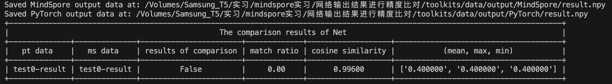

# 网络迁移&调试-使用迁移功能快速迁移网络

## 应用场景1：pth到ckpt权重自动转换
用户需要从pytorch网络迁移到MindSpore网络时，需要进行权重迁移，因为MindSpore的权重名称与Pytorch有差异，需要使用权重迁移工具进行权重自动化迁移。
### 结果展示
显示转换后的ckpt保持路径与名称，并给出详细的转换信息。


### 如何使用1-网络结构完全一致，权重自动转换
在MindSpore迁移后的网络结构与pytorch网络结构完全一致时，pth到ckpt转换，仅有权重名称差异，则可以通过如下方法完成权重的自动转换。
```python
import troubleshooter as ts

# pytroch的resnet50网络
net = resnet50(num_classes=10).cuda() if use_cuda else resnet50(num_classes=10)
pth_path="/mnt/d/06_project/m/resnet_pytorch_res/resnet_pytroch_res/resnet.pth"

# pt_model：pytorch网络名称
# pth_file_path：要转换的pth文件路径
# 注意：支持模型（例如：torch.save(torch_net, "torch_net.pth") ）和参数（例如：torch.save(torch_net.state_dict(), "torch_net.pth")
#      两种形式保存后的pth文件的自动加载，如果保存的pth文件内容经过定制，不能进行自动加载，可使用"pth_para_dict"直接传入加载并解析后的
#      权重参数字典
# pth_para_dict: 直接传入权重参数字典，当配置此项时pth_file_path参数将失效
# ckpt_save_path：保存MindSpore的ckpt的路径与文件名称
wm = ts.WeightMigrator(pt_model=net, pth_file_path=pth_path, ckpt_save_path='./convert_resnet.ckpt')
# 调用转换接口
wm.convert()
```
### 如何使用2-网络结构有一定差异，需要定制权重名称前缀

```python
import troubleshooter as ts

# pytroch的resnet50网络
net = resnet50(num_classes=10).cuda() if use_cuda else resnet50(num_classes=10)
pth_path="/mnt/d/06_project/m/resnet_pytorch_res/resnet_pytroch_res/resnet.pth"

# pt_model：pytorch网络名称
# pth_file_path：要转换的pth文件路径
# ckpt_save_path：保存MindSpore的ckpt的路径与文件名称
wm = ts.WeightMigrator(pt_model=net, pth_file_path=pth_path, ckpt_save_path='./convert_resnet.ckpt')
# 调用转换接口
wm.convert(weight_name_prefix="uvp", print_conv_info=True)
```

### 如何使用3-网络结构有一定差异，需要对权重名称做复杂的定制转换
在MindSpore迁移后的网络结构与pytorch网络结构不完全一致时，需要用户手工定义转换规则，此时工具提供了定制接口，满足此种场景下用户的定制诉求。

```python
import troubleshooter as ts

def custorm_weight_name(weight_name_map):
    prefix='.custorm.'
    custorm_name_map = {}
    for key, value in weight_name_map.items():
        index = value.find(".")
        value = value[0:index] + prefix + value[index+1:]
        print(key, ":", value)
        custorm_name_map[key] = str(value)
    return custorm_name_map

# pytroch的resnet50网络
net = resnet50(num_classes=10).cuda() if use_cuda else resnet50(num_classes=10)
pth_path="/mnt/d/06_project/m/resnet_pytorch_res/resnet_pytroch_res/resnet.pth"

# pt_model：pytorch网络名称
# pth_file_path：要转换的pth文件路径
# ckpt_save_path：保存MindSpore的ckpt的路径与文件名称
wm = ts.WeightMigrator(pt_model=net, pth_file_path=pth_path, ckpt_save_path='./convert_resnet.ckpt')

# 用户获得根据默认规则转换后的map，get_weight_map返回两个map，一个是name map用于名称转换，一个是value map用于值转换，此例子只有
# name map full_name_map:get_weight_map默认只返回自动转换的权重名称映射字典，配置为True则会返回所有权重名称映射字典，便于
# 用户进行批量名称定制print_map：打印映射的map
name_map, value_map = wm.get_weight_map(full_name_map=True, print_map=True)

# 用户可封装定制函数，例如：custorm_weight_name，然后通过修改w_map内容，完成映射关系的定制
w_map = custorm_weight_name(name_map)

# 将定制好的map传入转换接口
# weight_name_map：传入定制后的map，以定制后的map进行权重名称转换
wm.convert(weight_name_map=w_map)

# 执行结果：根据定制所有参数名称增加一个层custorm ，执行后举例: features.Linear_mm.weight 参数名称将转换为 
# features.custorm.Linear_mm.weight
```


## 应用场景2：将转换后的ckpt与MindSpore网络生成的ckpt进行对比
我们写完MindSpore网络后，就可以保存一个ckpt。我们可以将网络生产的ckpt与转换的ckpt（用权重转换工具从pth转换过来的ckpt）进行对比，
以起到验证网络结构是否正确等目的。当前仅支持名称与shape的比对。
### 结果展示

### 如何使用1

```python
import troubleshooter as ts

# pytroch的resnet50网络
net = resnet50(num_classes=10).cuda() if use_cuda else resnet50(num_classes=10)
pth_path="/mnt/d/06_project/m/resnet_pytorch_res/resnet_pytroch_res/resnet.pth"

# pt_model：pytorch网络名称
# pth_file_path：要转换的pth文件路径
# ckpt_save_path：保存MindSpore的ckpt的路径与文件名称
wm = ts.WeightMigrator(pt_model=net, pth_file_path=pth_path, ckpt_save_path='./convert_resnet.ckpt')
# print_conv_info：为False则不打印转换结果
wm.convert(print_conv_info=False)

ms_path = "/mnt/d/06_project/m/docs-r1.9/docs-r1.9/docs/mindspore/source_zh_cn/migration_guide/code/resnet_convert/resnet_ms/resnet.ckpt"
# ckpt_path：用户编写网络保存的ckpt文件路径
# print_result：1 打印所有比对结果  2仅打印比对不上的结果
# converted_ckpt_path：使用工具转换后的ckpt文件路径，在调用wm.convert后直接调用此接口，则不需要配置此参数。单独调用wm.compare_ckpt，
# 则需要配置此参数。
wm.compare_ckpt(ckpt_path=ms_path, print_result=1)
```

## 应用场景3：保存tensor
在网络迁移精度问题排查时，需要对网络中的数据进行保存。`troubleshooter`提供了支持`mindspore`和`pytorch`的统一数据保存接口，并支持文件自动编号功能。

### 接口定义

```python
ts.save(file:str, data:Union(Tensor, list[Tensor], tuple[Tensor], dict[str, Tensor], auto_id=True, suffix=None))
```
- file: 文件名路径。当`file`为`None`或`''`时，文件名会自动设置为`tensor_(shape)`，文件路径为当前路径。
- data: 数据，支持保存`Tensor`（包括`mindspore.Tensor`和`pytorch.tensor`），以及`Tensor`构成的`list/tuple/dict`。当为`list/tuple`类型时，会按照顺序添加编号；当为`dict`类型时，文件名中会添加`key`。
- auto_id: 自动编号，默认值为`True`。当为`True`时，保存时会自动为文件添加全局编号，编号从0开始。
- suffix: 文件名后缀，默认值为`None`。

**文件保存格式**

存储的文件名称为 `{id}_name_{idx/key}_{suffix}.npy`

### 如何使用

**支持mindspore动态图和静态图**

```python
import os
import shutil

import troubleshooter as ts
import mindspore as ms
from mindspore import nn, Tensor

class NetWorkSave(nn.Cell):
    def __init__(self, file):
        super(NetWorkSave, self).__init__()
        self.file = file

    def construct(self, x):
        ts.save(self.file, x)
        return x

x1 = Tensor(-0.5962, ms.float32)
x2 = Tensor(0.4985, ms.float32)
try:
    shutil.rmtree("/tmp/save/")
except FileNotFoundError:
    pass
os.makedirs("/tmp/save/")
net = NetWorkSave('/tmp/save/ms_tensor')

# 支持自动编号
out1 = net(x1)
# /tmp/save/0_ms_tensor.npy

out2 = net(x2)
# /tmp/save/1_ms_tensor.npy
```

**支持pytorch**

```python
import os
import shutil

import troubleshooter as ts
import torch
x1 = torch.tensor(-0.5962, dtype=torch.float32)
x2 = torch.tensor(0.4985, dtype=torch.float32)

try:
    shutil.rmtree("/tmp/save/")
except FileNotFoundError:
    pass
os.makedirs("/tmp/save/")

file = '/tmp/save/torch_tensor'

ts.save(file, x1)
# /tmp/save/0_torch_tensor.npy
ts.save(file, x2)
# /tmp/save/1_torch_tensor.npy
```

## 应用场景4：比较两组tensor值(npy文件)是否相等
进行网络迁移精度问题排查等场景，需要获取网络中的tensor值进行比较。一般我们将tensor保存成npy进行手工比较，此功能提供了批量对比两个目录下名称可以
映射的npy值的接口。
### 结果展示

### 如何使用1-两个目录下名称可自动映射

```python
import troubleshooter as ts

ta = "/mnt/d/06_project/troubleshooter/troubleshooter/tests/diff_handler/ta"
tb = "/mnt/d/06_project/troubleshooter/troubleshooter/tests/diff_handler/tb"
# 比较ta与tb目录下名称可以映射的npy文件的值
ts.diff_handler.compare_npy_dir(ta, tb)
```

### 如何使用2-两个目录下名称不能完全映射，需要手工调整

```python
import troubleshooter as ts

ta = "/mnt/d/06_project/troubleshooter/troubleshooter/tests/diff_handler/ta"
tb = "/mnt/d/06_project/troubleshooter/troubleshooter/tests/diff_handler/tb"
# 可以通过如下接口获取名称映射列表，对npy文件名称映射进行调整
name_list = ts.diff_handler.get_filename_map_list(ta, tb)
# 通过自定定义一个函数进行list的修改，例如：custom_fun(name_list)
name_list = custom_fun(name_list)
# 将调整后的名称传入比较接口
ts.diff_handler.compare_npy_dir(name_map_list=name_list)
```

## 应用场景5：比较mindspore和pytorch网络输出是否一致

在进行网络迁移时，由于大多数网络是使用pytorch搭建的，在迁移到mindspore过程中，我们需要比较mindspore和pytorch网络输出结果是否一致。此功能实现对比mindspore和pytorch的输出结果。

### 接口参数

| 参数         | 类型                      | 说明                                                         |
| ------------ | ------------------------- | ------------------------------------------------------------ |
| ms_net       | mindspore.nn.Cell         | mindspore模型实例                                            |
| pt_net       | torch.nn.Module           | torch模型实例                                                |
| input_data   | Union(list[Iterable[np.array]], list[Iterable[str]]) | 模型的输入。支持多输入，每个输入使用一个list。当list中为array时，将会依序使用其中的array作为模型的输入，每个array形状与模型输入形状相同，以图像分类任务为例，输入形状为[batch_size, num_channel, w, h]；当为str时，将会加载相应位置的npy文件作为模型输入。 对于单输入情况，用户需要传入[[input1, input2, ...]] 或者 [['input1.npy', 'input2.npy', ...]]；对于多输入，用户应当传入[[input1_1, input1_2, ...], [input2_1, input2_2, ...]]或者[['input1_1.npy', 'input1_2.npy', ...], ['input2_1.npy', 'input2_2.npy', ...]]|
| out_path     | str                       | 结果保存的文件夹，例如，'troubleshooter/results'            |
| print_result | bool                      | 是否打印输出结果，以及中间过程                               |

### 如何使用

可以参考troubleshooter/tests/diff_handler/test_netdifffinder.py中的使用方法，或者下面的使用方法：

```python
# 构造输入，这里假设测试用例有两个，分别为input1，input2；
input1 = [np.random.randn(1, 12).astype(np.float32), np.random.randn(1, 13).astype(np.float32)]
input2 = [np.random.randn(1, 12).astype(np.float32), np.random.randn(1, 13).astype(np.float32)]
# 实例化mindspore模型以及torch模型
ms_net = MSNet()
pt_net = TorchNet()
diff_finder = ts.NetDifferenceFinder(
  ms_net=ms_net,
  pt_net=pt_net,
  inputs=[input1, input2],
  out_path='troubleshooter/tests/diff_handler/results', 
  print_result=False,
)
diff_finder.compare()
```

### 结果展示

命令：

```python
python troubleshooter/tests/diff_handler/test_netdifffinder.py
```

输出结果：


