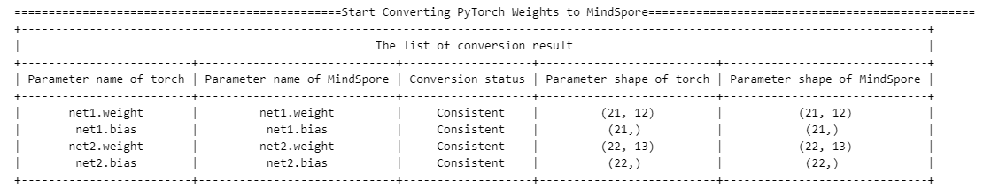

# 网络迁移&调试-使用迁移功能快速迁移网络

## 应用场景1：pth到ckpt权重自动转换
用户需要从PyTorch网络迁移到MindSpore网络时，需要进行权重迁移，因为MindSpore的权重名称与Pytorch有差异，需要使用权重迁移工具进行权重自动化迁移。
### 结果展示
显示转换后的ckpt保存路径与名称，并给出详细的转换信息。


### 如何使用1-网络结构完全一致，权重自动转换
在MindSpore迁移后的网络结构与PyTorch网络结构完全一致时，pth到ckpt转换，仅有权重名称差异，则可以通过如下方法完成权重的自动转换。
```python
import troubleshooter as ts

torch_net = resnet50(num_classes=10)
pth_path="./resnet.pth"

"""
pt_net：PyTorch网络实例；
weight_map_save_path：转换后的权重映射表路径；
print_map: 是否打印映射表。
"""
ts.migrator.get_weight_map(pt_net=torch_net,
                           weight_map_save_path="/tmp/torch_net_map.json",
                           print_map=True)
"""
weight_map_path: get_weight_map生成的权重映射表路径；
pt_file_path: PyTorch的pth文件路径。支持模型（例如：torch.save(torch_net, "torch_net.pth") ）和
参数（例如：torch.save(torch_net.state_dict(), "torch_net.pth"), 两种形式pth文件的自动加载。
如果保存的pth文件内容经过定制，不能进行自动加载，可使用"pth_para_dict"直接传入加载并解析后的权重参数字典；
ms_file_save_path: 转换后的MindSpore的ckpt文件路径。
"""
ts.migrator.convert_weight(weight_map_path="/tmp/torch_net_map.json",
                           pt_file_path="/tmp/torch_net.pth",
                           ms_file_save_path='/tmp/convert_resnet.ckpt')
```
### 如何使用2-网络结构有一定差异，需要定制权重名称前缀

```python
import troubleshooter as ts

# PyTorch的resnet50网络
torch_net = resnet50(num_classes=10)
pth_path="./resnet.pth"

# weight_name_prefix：需要添加的权重前缀
ts.migrator.get_weight_map(pt_net=torch_net,
                           weight_map_save_path="/tmp/torch_net_map.json",
                           weight_name_prefix='uvp',
                           print_map=True)
# 调用转换接口
ts.migrator.convert_weight(weight_map_path="/tmp/torch_net_map.json",
                           pt_file_path="/tmp/torch_net.pth",
                           ms_file_save_path='/tmp/convert_resnet.ckpt')
```

### 如何使用3-网络结构有一定差异，需要对权重名称做复杂的定制转换
在MindSpore迁移后的网络结构与PyTorch网络结构不完全一致时，需要用户手工定义转换规则，此时工具提供了定制接口，满足此种场景下用户的定制诉求。

```python
import troubleshooter as ts

def custorm_weight_name(weight_name_map):
    prefix='.custorm.'
    custorm_name_map = {}
    for key, value in weight_name_map.items():
        index = value.find(".")
        value = value[0:index] + prefix + value[index+1:]
        print(key, ":", value)
        custorm_name_map[key] = str(value)
    return custorm_name_map

# PyTorch的resnet50网络
torch_net = resnet50(num_classes=10)
pth_path="./resnet.pth"

"""
custom_name_func: 可封装定制函数，例如：custorm_weight_name，完成映射关系的定制
"""
ts.migrator.get_weight_map(pt_net=torch_net,
                           weight_map_save_path="/tmp/torch_net_map.json",
                           custom_name_func=custorm_weight_name,
                           print_map=True)

# 调用转换接口
ts.migrator.convert_weight(weight_map_path="/tmp/torch_net_map.json",
                           pt_file_path="/tmp/torch_net.pth",
                           ms_file_save_path='/tmp/convert_resnet.ckpt')

# 执行结果：根据定制所有参数名称增加一个层custorm ，执行后举例: features.Linear_mm.weight 参数名称将转换为
# features.custorm.Linear_mm.weight
```


## 应用场景2：比对MindSpore与PyTorch的ckpt/pth

1. 在迁移网络到MindSpore后，为检验网络结构是否相同，我们可以保存迁移后网络生产的ckpt与转换的ckpt（用权重转换工具从pth转换过来的ckpt）进行结构对比，以验证网络结构的正确性。
2. 在迁移网络训练中，在固定随机性后，如果网络输出的第一个loss相同，之后的loss不一致，可以分别保存ckpt与pth，通过比较ckpt与pth的对应参数的值来检验网络反向更新的结果。

### 接口定义

#### ```compare_ms_ckpt(orig_file_path, target_file_path, **kwargs)```

用于比较两个MindSpore的ckpt的结构和数值的差异。

**位置参数：**

- orig_file_path(str)：原始的ckpt的路径。
- target_file_path(str)：目标ckpt的路径。

**kwargs参数：**

- compare_value(bool)：是否进行数值比较，默认值为True。为True时，会分别输出shape和value两个差异分析表格。
- print_level(int)：日志等级，默认值为1。为0时不输出比较结果，为1时输出所有结果，为2时仅输出有差异的结果。
- rtol(float): 开启数值比较时的比较参数，相对误差，默认值为`1e-4`，内部调用`numpy.allclose`的参数。
- atol(float): 开启数值比较时的比较参数，绝对误差，默认值为`1e-4`，内部调用`numpy.allclose`的参数。
- equal_nan(bool)：开启数值比较时的比较参数，是否将nan视为相等，默认值为 `False`，内部调用`numpy.allclose`的参数。

**样例：**
```python
import troubleshooter as ts
import mindspore as ms
from mindspore import nn


class NetA(nn.Cell):
    def __init__(self):
        super(NetA, self).__init__()
        self.fc1 = nn.Dense(2, 10)
        self.bn1 = nn.BatchNorm1d(10)
        self.fc2 = nn.Dense(10, 1)
        self.relu = nn.ReLU()
        self.sigmoid = nn.Sigmoid()

    def construct(self, x):
        x = self.relu(self.bn1(self.fc1(x)))
        x = self.sigmoid(self.fc2(x))
        return x

class NetB(nn.Cell):
    def __init__(self):
        super(NetB, self).__init__()
        self.fc1 = nn.Dense(3, 10)
        self.bn1 = nn.BatchNorm1d(10)
        self.fc2 = nn.Dense(10, 1)
        self.relu = nn.ReLU()
        self.sigmoid = nn.Sigmoid()
        

    def construct(self, x):
        x = self.relu(self.bn1(self.fc1(x)))
        x = self.sigmoid(self.fc2(x))
        return x

net_0 = NetA()
net_1 = NetB()
ms.save_checkpoint(net_0, "net_a.ckpt")
ms.save_checkpoint(net_1, "net_b.ckpt")
```

```python
# Comparing all
ts.migrator.compare_ms_ckpt("net_a.ckpt", "net_b.ckpt")
```

```python
# Comparing all, only print difference
ts.migrator.compare_ms_ckpt("net_a.ckpt", "net_b.ckpt", print_level=2)
```

```python
# Comparing network parameter structures, only print difference
ts.migrator.compare_ms_ckpt("net_a.ckpt", "net_b.ckpt", compare_value=False, print_level=2)
```


#### ```compare_pth_and_ckpt(weight_map_path, pt_file_path, ms_file_path, **kwargs)```

用于比较PyTorch和MindSpore的结构和数值差异。

**位置参数：**
- weight_map_path(str)：通过get_weight_map函数生成的权重映射表路径。
- pt_file_path(str)：PyTorch的pth文件路径。
- ms_file_path(str)：MindSpore的ckpt的文件路径。

**kwargs参数：**

- compare_value(bool)：是否进行数值比较，默认值为True。为True时，会分别输出shape和value两个差异分析表格。
- print_level(int)：日志等级，默认值为1。为0时不输出比较结果，为1时输出所有结果，为2时仅输出有差异的结果。
- rtol(float): 开启数值比较时的比较参数，相对误差，默认值为`1e-4`，内部调用`numpy.allclose`的参数。
- atol(float): 开启数值比较时的比较参数，绝对误差，默认值为`1e-4`，内部调用`numpy.allclose`的参数。
- equal_nan(bool)：开启数值比较时的比较参数，是否将nan视为相等，默认值为 `False`，内部调用`numpy.allclose`的参数。

**样例：**
```python
import troubleshooter as ts
import torch
import mindspore as ms
from mindspore import nn


class PTNet(torch.nn.Module):
    def __init__(self):
        super(PTNet, self).__init__()
        self.fc1 = torch.nn.Linear(2, 10)
        self.bn1 = torch.nn.BatchNorm1d(10)
        self.fc2 = torch.nn.Linear(10, 1)
        self.relu = torch.nn.ReLU()
        self.sigmoid = torch.nn.Sigmoid()

    def construct(self, x):
        x = self.relu(self.bn1(self.fc1(x)))
        x = self.sigmoid(self.fc2(x))
        return x

class MSNet(nn.Cell):
    def __init__(self):
        super(MSNet, self).__init__()
        self.fc1 = nn.Dense(3, 10)
        self.bn1 = nn.BatchNorm1d(10)
        self.fc2 = nn.Dense(10, 1)
        self.relu = nn.ReLU()
        self.sigmoid = nn.Sigmoid()

    def construct(self, x):
        x = self.relu(self.bn1(self.fc1(x)))
        x = self.sigmoid(self.fc2(x))
        return x

pt_net = PTNet()
ms_net = MSNet()
ts.migrator.get_weight_map(pt_net=pt_net,
                           weight_map_save_path="torch_net_map.json")
torch.save(pt_net.state_dict(), "pt_net.pth")
ms.save_checkpoint(ms_net, "ms_net.ckpt")
ts.migrator.compare_pth_and_ckpt("torch_net_map.json", "pt_net.pth", "ms_net.ckpt", print_level=2)
```


## 应用场景3：保存Tensor
在网络迁移精度问题排查时，需要对网络中的数据进行保存。`troubleshooter`提供了支持`MindSpore`和`PyTorch`的统一数据保存接口，并支持文件自动编号功能。以下只做简单介绍，详细用法请参考[save文档](api/save.md)。

**样例**

支持MindSpore与Pytorch。

**MindSpore**
```python
import tempfile
from pathlib import Path

import troubleshooter as ts
import mindspore as ms
from mindspore import nn, Tensor

class NetWorkSave(nn.Cell):
    def __init__(self, file):
        super(NetWorkSave, self).__init__()
        self.file = file

    def construct(self, x):
        ts.save(self.file, x)
        return x

x1 = Tensor(-0.5962, ms.float32)
x2 = Tensor(0.4985, ms.float32)
dir = tempfile.TemporaryDirectory(prefix="save")
path = Path(dir.name)
net = NetWorkSave(str(path / "ms_tensor"))

# 文件会自动编号
out1 = net(x1)
# 0_ms_tensor.npy

out2 = net(x2)
# 1_ms_tensor.npy

out3 = net([x1, x2])
# 2_ms_tensor.0.npy
# 3_ms_tensor.1.npy

out4 = net({"x1": x1, "x2":x2})
# 4_ms_tensor.x1.npy
# 5_ms_tensor.x2.npy
```
**Pytorch**
```python
import tempfile
from pathlib import Path

import troubleshooter as ts
import torch
x1 = torch.tensor([-0.5962, 0.3123], dtype=torch.float32)
x2 = torch.tensor([[0.4985],[0.4323]], dtype=torch.float32)
dir = tempfile.TemporaryDirectory(prefix="save")
path = Path(dir.name)
file = str(path / "torch_tensor")

ts.save(file, x1)
# 0_torch_tensor.npy

ts.save(file, x2)
# 1_torch_tensor.npy

ts.save(file, {"x1":x1, "x2":x2})
# 2_torch_tensor.x1.npy
# 3_torch_tensor.x2.npy

ts.save(file, {"x1":x1, "x2":x2}, suffix="torch")
# 4_torch_tensor.x1_torch.npy
# 5_torch_tensor.x2_torch.npy
```

## 应用场景4：比较两组Tensor值(npy文件)是否相等
进行网络迁移精度问题排查等场景，需要获取网络中的Tensor或者梯度等数据进行比较。

### 文件批量比较
TroubleShooter提供了批量对比两个目录下npy文件的功能，以下只做简单介绍，详细用法请参考[compare_npy_dir文档](api/migrator/compare_npy_dir.md)。

**样例**
```python
import troubleshooter as ts
import os
import tempfile
import mindspore as ms

data1 = ms.ops.randn((2,3))
data2 = ms.ops.randn((3,5))
cache_dir1 = tempfile.TemporaryDirectory(prefix='ta')
cache_dir2 = tempfile.TemporaryDirectory(prefix='tb')
path1 = cache_dir1.name
path2 = cache_dir2.name

ts.save(os.path.join(path1, 'data'), [data1, data2])
ts.save(os.path.join(path2, 'data'), [data1, data1])
# Use matching in numerical order
name_map = ts.migrator.get_name_map_list_by_number(path1, path2)
ts.migrator.compare_npy_dir(path1, path2, name_map_list=name_map)
```
**结果**
```bash
2023-11-16 11:32:33,882 - troubleshooter.log - WARNING - [*User Attention*] The compare directory information:
 The orig dir: /tmp/ta9553n79z 
 The target dir: /tmp/tb07pjiank
100%|███████████████████████████████████████████████████████████████████████████████████████████████████| 2/2 [00:06<00:00,  3.21s/it]
+------------------------------------------------------------------------------------------------------------------------+
|                                             The list of comparison results                                             |
+-----------------+-------------------+-----------------------+-------------------+-------------------+------------------+
| orig array name | target array name |   result of allclose  | ratio of allclose | cosine similarity | mean & max diffs |
+-----------------+-------------------+-----------------------+-------------------+-------------------+------------------+
|   0_data_0.npy  |    1_data_0.npy   |          True         |      100.00%      |      1.00000      | 0.00000, 0.00000 |
|   0_data_1.npy  |    1_data_1.npy   | Shape is inconsistent |       0.00%       |        nan        |     nan, nan     |
+-----------------+-------------------+-----------------------+-------------------+-------------------+------------------+
```

### 梯度比较

批量对比两个目录下使用`ts.save`保存梯度得到的npy文件。以下只做简单介绍，详细用法请参考[compare_grads_dir文档](api/migrator/compare_grads_dir.md)

**样例**
```python
import os
import numpy as np
import troubleshooter as ts
import torch
import mindspore as ms
import tempfile
from pathlib import Path
class PtSimpleNet(torch.nn.Module):
    def __init__(self):
        super(PtSimpleNet, self).__init__()
        self.fc = torch.nn.Linear(10, 5)
        self.bn = torch.nn.BatchNorm1d(5)
    def forward(self, x):
        return self.bn(self.fc(x))

class MsSimpleNet(ms.nn.Cell):
    def __init__(self):
        super(MsSimpleNet, self).__init__()
        self.fc = ms.nn.Dense(10, 5)
    def construct(self, x):
        return self.fc(x)

pt_dir = tempfile.TemporaryDirectory(prefix="pt_")
ms_dir = tempfile.TemporaryDirectory(prefix="ms_")
pt_outpath = Path(pt_dir.name)
ms_outpath = Path(ms_dir.name)
inputs = np.random.randn(32, 10).astype(np.float32)
targets = np.random.randn(32, 5).astype(np.float32)

pt_net = PtSimpleNet()
pt_criterion = torch.nn.MSELoss()
pt_optimizer = torch.optim.SGD(pt_net.parameters(), lr=0.01)
pt_outputs = pt_net(torch.tensor(inputs))
pt_loss = pt_criterion(pt_outputs, torch.tensor(targets))
pt_optimizer.zero_grad()
pt_loss.backward()
# use ts.widget.get_pt_grads get torch grads
pt_grads = ts.widget.get_pt_grads(pt_net)
ts.save(str(pt_outpath / "torch_grads"), pt_grads)

ms_net = MsSimpleNet()
ms_loss_fn = ms.nn.MSELoss()

def forward_fn(inputs, targets):
    out = ms_net(inputs)
    loss = ms_loss_fn(out, targets)
    return loss

grad_fn = ms.value_and_grad(forward_fn, None, ms_net.trainable_params())
ms_loss, ms_grads = grad_fn(ms.Tensor(inputs), ms.Tensor(targets))
ts.save(str(ms_outpath / "ms_grads"), ms_grads)
ts.migrator.compare_grads_dir(pt_outpath, ms_outpath)
```
**结果：**
```bash
2023-11-18 17:31:45,065 - troubleshooter.log - WARNING - [*User Warning*] The number of files or their corresponding shapes are inconsistent, and some files may not be correctly mapped.
2023-11-18 17:31:45,066 - troubleshooter.log - WARNING - [*User Attention*] The compare directory information:
 The orig dir: /tmp/pt_9xatcvr0 
 The target dir: /tmp/ms_kfaide32
100%|██████████████████████████████████████████████████████████████████████████████████████████████████████████████████████████████████████████████████████████████████████████████████████████████████| 4/4 [00:07<00:00,  1.92s/it]
+---------------------------------------------------------------------------------------------------------------------------------------------------------------------+
|                                                                    The list of comparison results                                                                   |
+-------------------------------+-------------------+---------------+-----------------+--------------------+-------------------+-------------------+------------------+
|        orig array name        | target array name | shape of orig | shape of target | result of allclose | ratio of allclose | cosine similarity | mean & max diffs |
+-------------------------------+-------------------+---------------+-----------------+--------------------+-------------------+-------------------+------------------+
| 0_torch_grads_fc.weight_0.npy |  1_ms_grads_0.npy |    (5, 10)    |     (5, 10)     |       False        |       0.00%       |      0.52350      | 0.10281, 0.34079 |
|  0_torch_grads_fc.bias_1.npy  |  1_ms_grads_1.npy |      (5,)     |       (5,)      |       False        |       0.00%       |      0.17462      | 0.17567, 0.22836 |
| 0_torch_grads_bn.weight_2.npy |        None       |      (5,)     |       None      |       False        |       0.00%       |        nan        |     nan, nan     |
|  0_torch_grads_bn.bias_3.npy  |        None       |      (5,)     |       None      |       False        |       0.00%       |        nan        |     nan, nan     |
+-------------------------------+-------------------+---------------+-----------------+--------------------+-------------------+-------------------+------------------+
```


## 应用场景5：比较MindSpore和PyTorch网络输出是否一致

在进行网络迁移时，由于大多数网络是使用PyTorch搭建的，在迁移到MindSpore过程中，我们需要比较MindSpore和PyTorch网络输出结果是否一致。此功能实现对比MindSpore和PyTorch的输出结果。

### 接口定义
#### ```class NetDifferenceFinder```
##### ```__init__(pt_net, ms_net, print_level=1, **kwargs)```

**位置参数：**
- pt_net(`torch.nn.Module`): torch模型实例
- ms_net(`mindspore.nn.Cell`): MindSpore模型实例
- print_level(int): 日志打印等级，默认值为1。

**kwargs参数：**
- pt_params_path(`str`, 可选): torch模型参数文件路径
- ms_params_path(`str`, 可选): MindSpore模型参数文件路径
- auto_conv_ckpt(`int`, 可选): 权重自动转换方式，默认值为1。为0时，不进行权重转换；为1时为PyTorch权重转换到MindSpore；为2时为PyTorch权重转换到MSAdapter。
- compare_params(`bool`, 可选): 是否开启网络参数对比，默认值为True。开启时，会使用PyTorch的保存的pth和MindSpore保存的ckpt进行比较，以校验网络结构。
> **说明：**
> 1. 默认参数下，会将PyTorch网络的权重保存、转换并加载MindSpore网络中，以保证两边的模型权重初始化一致。除此以外，还会将PyTorch的权重文件和MindSpore网络自身保存的权重文件进行比对，以校验网络结构。
> 2. 当同时传入`pt_params_path`和`ms_params_path`时，会从文件中加载权重执行正向推理（`auto_conv_ckpt`会失效），不会进行权重转换;
> 3. 当前仅支持权重从PyTorch转换到MindSpore，当传入`ms_params_path`，`pt_params_path`为空时，需要将`auto_conv_ckpt`设置为0，并自己保证权重初始化一致；
##### ```compare(inputs=None, auto_inputs=None, **kwargs)```

| 参数            | 类型                                                         | 说明                                                         |
| --------------- | ------------------------------------------------------------ | ------------------------------------------------------------ |
| inputs      | 单输入：`Union(tuple[torch.Tensor], tuple[mindspore.Tensor], tuple[numpy.ndarray], tuple[str])`；多输入：`list[Union(tuple[torch.Tensor], tuple[mindspore.Tensor], tuple[numpy.ndarray], tuple[str])]` | 模型输入。模型输入支持`torch.Tensor`, `mindspore.Tensor`, `np.ndarray`以及`str`，每个`tuple`中包含一个模型输入；当用户想要同时验证多组数据时，请使用一个列表存放所有输入。 |
| auto_inputs | 单输入：`tuple[tuple[numpy.shape, numpy.dtype]]`；多输入：`{'input': tuple[tuple[numpy.shape, numpy.dtype]], 'num':int}` | 默认为`None`，为了方便用户快速验证。用户可以不输入`inputs`，而是输入`auto_inputs`，`auto_inputs`每一个元素为模型输入的`shape`，如果需要使用多次测试，可以传入一个字典，字典的键为`'input'`和`'num'`，分别表示每次的输入以及输入个数 |
| rtol            | `float`                                                      | 相对误差，默认值为`1e-4`，内部调用`numpy.allclose`的参数。 |
| atol            | `float`                                                      | 绝对误差，默认值为`1e-4`，内部调用`numpy.allclose`的参数。 |
| equal_nan       | `bool`                                                       | 是否将nan视为相等，默认值为 `False`，内部调用`numpy.allclose`的参数。 |


### 如何使用

可以参考[test_netdifffinder.py](https://gitee.com/mindspore/toolkits/blob/master/tests/st/troubleshooter/diff_handler/test_netdifffinder.py)中的使用方法，以下为伪代码：

```python
pt_net = ConstTorch()
ms_net = ConstMS()
diff_finder = ts.migrator.NetDifferenceFinder(
    pt_net=pt_net,
    ms_net=ms_net)
diff_finder.compare(auto_inputs=(((1, 12), np.float32), ))
```

输出结果：
默认参数下，输出主要包含权重转换（当auto_conv_ckpt为2，对应MSAdapter模式时，由于权重一致，因此没有此过程）、PyTorch和MindSpore的权重比较、网络推理三部分。

**权重转换**

此过程会将输入的PyTorch网络自动保存pth文件，并转换为MindSpore的ckpt文件。转换中会显示转换详情。

**权重比较**

在权重转换之后，会将转换后的ckpt加载到MindSpore的网络中。为确认两边模型参数一致，此过程会将加载后网络保存的ckpt和PyTorch的pth文件进行比较，包括shape和value两部分。


**网络推理**

最后会执行网络推理。此过程会固定随机性，并将PyTorch的网络设置为`eval`模式，MindSpore设置`set_train(False)`。将构造的数据分别输入到两个网络中执行前向推理，获得对应结果，最后比较结果的差异。


> **提示：**
> 对于MindSpore和PyTorch模型不在同一个项目中的情况，无法直接比较网络输出，可以使用`sys.path.insert(0, path)`来把模型所在的项目加入系统路径，然后实例化模型比较。例如：
> ```python
> import sys
> sys.path.insert(0, "path to your mindspore model define project")
> sys.path.insert(0, "path to your pytorch model define project")
> from xxx import TorchNet
> from xxx import MSNet
> pt_net = TorchNet()
> ms_net = MSNet()
> diff_finder = ts.migrator.NetDifferenceFinder(
>     pt_net=pt_net,
>     ms_net=ms_net)
> diff_finder.compare(auto_inputs=(((1, 12), np.float32), ))
> ```
