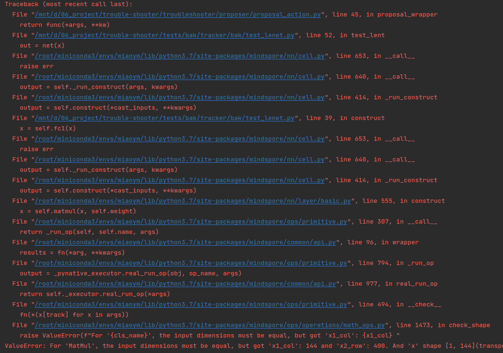
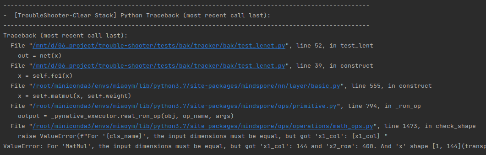

# 网络错误调试-使用Proposal功能自动分析报错

## 应用场景1：自动生成报错处理建议（在线分析）
用户在使用MindSpore开发网络时，经常会遇到因各种原因导致的MindSpore报错，此功能自动进行MindSpore报错分析并提供分析报告，分析报告包含：MindSpore版本信息、可能原因、处理建议、相关案例等内容，辅助用户解决相关问题。
### 结果展示：

### 如何使用：

#### 方法1：使用装饰器 @ts.proposal()
        import numpy as np
        import mindspore
        from mindspore import ops, Tensor, nn
        import troubleshooter as ts

        class Net(nn.Cell):
            def __init__(self):
                super().__init__()
                self.relu = ops.ReLU()
                self.reducesum = ops.ReduceSum()

            def construct(self, x, a, b):
                if a > b:
                    return self.relu(x)  # shape: (2, 3, 4, 5), dtype:Float32
                else:
                    return self.reducesum(x)  # shape:(), dype: Float32

        # 通过装饰器，装饰在执行函数前
        @ts.proposal()
        def main():
            input_x = Tensor(np.random.rand(2, 3, 4, 5).astype(np.float32))
            input_a = Tensor(2, mindspore.float32)
            input_b = Tensor(6, mindspore.float32)
            net = Net()
            out = net(input_x, input_a, input_b)

        if __name__ == '__main__':
            main()

#### 方法2：使用with ts.proposal()
    import numpy as np
    import mindspore
    from mindspore import ops, Tensor, nn
    import troubleshooter as ts

    class Net(nn.Cell):
        def __init__(self):
            super().__init__()
            self.relu = ops.ReLU()
            self.reducesum = ops.ReduceSum()

        def construct(self, x, a, b):
            if a > b:
                return self.relu(x)  # shape: (2, 3, 4, 5), dtype:Float32
            else:
                return self.reducesum(x)  # shape:(), dype: Float32

    # 通过with 来实现片段代码分析
    with ts.proposal():
        input_x = Tensor(np.random.rand(2, 3, 4, 5).astype(np.float32))
        input_a = Tensor(2, mindspore.float32)
        input_b = Tensor(6, mindspore.float32)
        net = Net()
        out = net(input_x, input_a, input_b)

## 应用场景2：已生成的报错自动分析（离线分析）
参考如下例子构建用例，将MindSpore的报错信息，从第一个Traceback (most recent call last): 到最后一行打印的信息，全部拷贝到字符串中，使用raise抛出，即可被proposal捕获并分析。

        import troubleshooter as ts
        
        @ts.proposal()
        def main():
            error = """
            Traceback (most recent call last):
              File "/mnt/d/06_project/trouble-shooter/examples/proposal_demo_1.py", line 25, in <module>
                out = net(input_x, input_a, input_b)
              File "/root/envs/lib/python3.7/site-packages/mindspore/nn/cell.py", line 596, in __call__
                out = self.compile_and_run(*args)
              File "/root/envs/lib/python3.7/site-packages/mindspore/nn/cell.py", line 985, in compile_and_run
                self.compile(*inputs)
              File "/root/envs/lib/python3.7/site-packages/mindspore/nn/cell.py", line 957, in compile
                jit_config_dict=self._jit_config_dict)
              File "/root/envs/lib/python3.7/site-packages/mindspore/common/api.py", line 1131, in compile
                result = self._graph_executor.compile(obj, args_list, phase, self._use_vm_mode())
            ValueError: Cannot join the return values of different branches, perhaps you need to make them equal.
            Shape Join Failed: shape1 = (2, 3, 4, 5), shape2 = ().
            For more details, please refer to https://www.mindspore.cn/search?inputValue=Shape%20Join%20Failed
            ......    
            ----------------------------------------------------
            - C++ Call Stack: (For framework developers)
            ----------------------------------------------------
            mindspore/ccsrc/pipeline/jit/static_analysis/static_analysis.cc:850 ProcessEvalResults
            """
            raise ValueError(error)

        if __name__ == '__main__':
            main()

## 应用场景3：显示简洁异常调用栈(删除部分框架栈信息)
部分框架内部栈信息会影响用户阅读调用栈，此功能以黑名单方式过滤掉部分栈信息，使网络调用栈打印的更为简洁，用户更容易观察到框架调用关系。

### 结果展示：
开启前

开启后

### 如何使用：配置print_clear_stack=True参数（默认False）

        @ts.proposal(print_clear_stack=True)
        def test_lent():
            context.set_context(mode=context.PYNATIVE_MODE, device_target="CPU")
            x = np.arange(1 * 24 * 24).reshape(1, 1, 24, 24)
            x = Tensor(x, ms.float32)
            net = LeNet5()
            out = net(x)
    