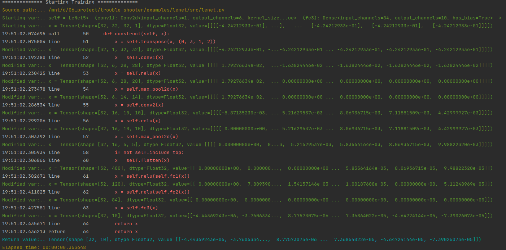
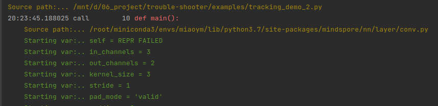
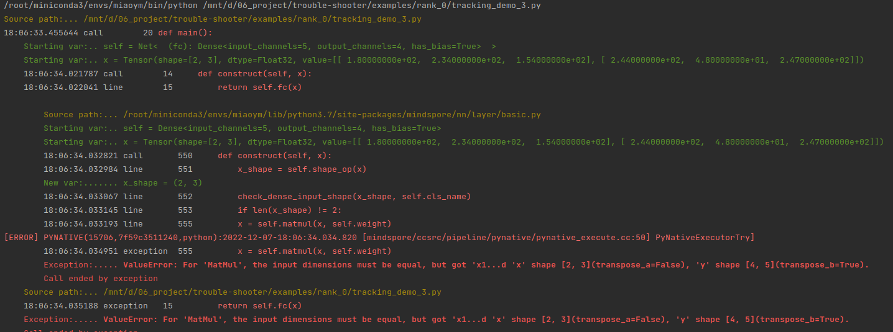
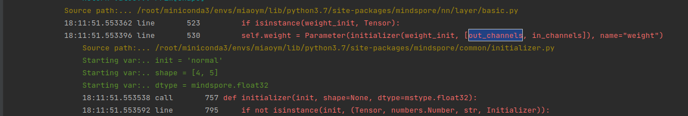

# 网络执行跟踪-使用tracking功能跟踪网络执行

***说明：tracking功能仅能跟踪python代码，功能仅对PyNative模式有效果，图模式仅能跟踪Python阶段信息***

## 应用场景1：打印运行时的网络信息(结构、shape)
### 结果展示：

### 如何使用：
跟踪可以通过level参数控制跟踪信息
* level=1(默认) 仅跟踪用户脚本中的construct函数
* level=2 跟踪用户脚本以及MindSpore主要的Python执行代码
* level=3 跟踪用户脚本以及MindSpore的全部Python执行代码
* level=4 跟踪用户脚本、MindSpore、Python库以及第三方包的所有Python执行代码

通过depth控制跟踪的调用栈深度，一般不需要调整，如果需要跟踪的代码调用层级很深，可通过配置depth解决
* depth=15(默认)

#### 方法1：使用装饰器 @ts.tracking()
        import mindspore.nn as nn
        from mindspore import ops
        from mindspore.common.initializer import Normal
        import troubleshooter as ts

        class LeNet5(nn.Cell):
            """
            Lenet network

            Args:
                num_class (int): Number of classes. Default: 10.
                num_channel (int): Number of channels. Default: 1.

            Returns:
                Tensor, output tensor
            Examples:
                >>> LeNet(num_class=10)

            """
            def __init__(self, num_class=10, num_channel=1, include_top=True):
                super(LeNet5, self).__init__()
                self.conv1 = nn.Conv2d(num_channel, 6, 5, pad_mode='valid')
                self.conv2 = nn.Conv2d(6, 16, 5, pad_mode='valid')
                self.relu = nn.ReLU()
                self.max_pool2d = nn.MaxPool2d(kernel_size=2, stride=2)
                self.include_top = include_top
                self.transpose = ops.Transpose()
                if self.include_top:
                    self.flatten = nn.Flatten()
                    self.fc1 = nn.Dense(16 * 5 * 5, 120, weight_init=Normal(0.02))
                    self.fc2 = nn.Dense(120, 84, weight_init=Normal(0.02))
                    self.fc3 = nn.Dense(84, num_class, weight_init=Normal(0.02))

            # 跟踪construct函数执行
            @ts.tracking()
            def construct(self, x):
                x = self.transpose(x, (0, 3, 1, 2))
                x = self.conv1(x)
                x = self.relu(x)
                x = self.max_pool2d(x)
                x = self.conv2(x)
                x = self.relu(x)
                x = self.max_pool2d(x)
                if not self.include_top:
                    return x
                x = self.flatten(x)
                x = self.relu(self.fc1(x))
                x = self.relu(self.fc2(x))
                x = self.fc3(x)
                return x

#### 方法2：使用装饰器 with ts.tracking()

        import mindspore.nn as nn
        from mindspore import ops
        from mindspore.common.initializer import Normal
        import troubleshooter as ts

        class LeNet5(nn.Cell):
            """
            Lenet network

            Args:
                num_class (int): Number of classes. Default: 10.
                num_channel (int): Number of channels. Default: 1.

            Returns:
                Tensor, output tensor
            Examples:
                >>> LeNet(num_class=10)

            """
            def __init__(self, num_class=10, num_channel=1, include_top=True):
                super(LeNet5, self).__init__()
                self.conv1 = nn.Conv2d(num_channel, 6, 5, pad_mode='valid')
                self.conv2 = nn.Conv2d(6, 16, 5, pad_mode='valid')
                self.relu = nn.ReLU()
                self.max_pool2d = nn.MaxPool2d(kernel_size=2, stride=2)
                self.include_top = include_top
                self.transpose = ops.Transpose()
                if self.include_top:
                    self.flatten = nn.Flatten()
                    self.fc1 = nn.Dense(16 * 5 * 5, 120, weight_init=Normal(0.02))
                    self.fc2 = nn.Dense(120, 84, weight_init=Normal(0.02))
                    self.fc3 = nn.Dense(84, num_class, weight_init=Normal(0.02))

            def construct(self, x):
                x = self.transpose(x, (0, 3, 1, 2))
                x = self.conv1(x)
                x = self.relu(x)
                x = self.max_pool2d(x)
                x = self.conv2(x)
                x = self.relu(x)
                # 使用with 仅打印部分输出
                with ts.tracking():
                    x = self.max_pool2d(x)
                    if not self.include_top:
                        return x
                    x = self.flatten(x)
                    x = self.relu(self.fc1(x))
                    x = self.relu(self.fc2(x))
                    x = self.fc3(x)
                return x

## 应用场景2：获取INF/NAN值抛出点
### 结果展示：
x = self.sqrt(y) 出现 nan, 给出“User Warning 'nan' is detected”报错。

### 如何使用：
#### 方法1：使用ts.tracking的“check_keyword”参数
* check_keyword：用于设置需要检查的值
* check_mode：用于设置检查模式,1:检查到值即退出并打印用户告警日志（默认）,2:检查到值不退出，仅打印用户告警日志

        import mindspore
        import numpy as np
        from mindspore import nn, ops, Tensor
        import troubleshooter as ts

        mindspore.set_context(mode=mindspore.PYNATIVE_MODE)

        class Net(nn.Cell):
            def __init__(self):
                super().__init__()
                self.sqrt = ops.Sqrt()
                self.matmul = ops.MatMul()

            def construct(self, input_x):
                y = self.matmul(input_x, input_x)
                x = self.sqrt(y)
                return x

        # 配置检查值
        @ts.tracking(check_mode=1, check_keyword='nan') 
        def nan_func():
            input_x = Tensor(np.array([[0.0, -1.0], [4.0, 3.0]]))
            k = 3.0
            net = Net()
            print(net(input_x))

        nan_func()

#### 方法2：ts.tracking的“check_keyword”参数与“level”参数共同使用
通过配置level级别或者更详细的跟踪信息

        import mindspore
        import numpy as np
        from mindspore import nn, ops, Tensor
        import troubleshooter as ts

        mindspore.set_context(mode=mindspore.PYNATIVE_MODE)

        class Net(nn.Cell):
            def __init__(self):
                super().__init__()
                self.sqrt = ops.Sqrt()
                self.matmul = ops.MatMul()

            def construct(self, input_x):
                y = self.matmul(input_x, input_x)
                x = self.sqrt(y)
                return x

        # 配置检查值
        @ts.tracking(level=2,  check_keyword='nan') 
        def nan_func():
            input_x = Tensor(np.array([[0.0, -1.0], [4.0, 3.0]]))
            k = 3.0
            net = Net()
            print(net(input_x))

        nan_func()

## 应用场景3：按照路径黑白名单过滤跟踪信息
### 结果展示：
配置路径白名单,仅跟踪'layer/conv.py'文件中的代码

### 如何使用：
#### 方法1：使用ts.tracking的“path_wl”白名单参数
        import mindspore
        import numpy as np
        from mindspore import nn, ops, Tensor
        import troubleshooter as ts

        mindspore.set_context(mode=mindspore.PYNATIVE_MODE)

        # 使用path_wl白名单，仅打印白名单文件中的代码跟踪
        @ts.tracking(level=1, path_wl=['layer/conv.py'])
        def main():
            conv = nn.Conv2d(3, 2, 3, pad_mode='valid', weight_init="ones")
            relu = nn.ReLU()
            seq = nn.SequentialCell([conv, relu])
            x = Tensor(np.ones([1, 3, 4, 4]), dtype=mindspore.float32)
            
#### 方法2：使用ts.tracking的“path_bl”黑名单参数
           
            # 黑名单与level 可同时使用，先通过level过滤，再通过黑名单过滤
            @ts.tracking(level=2, color=False, path_bl=['layer/activation.py'])
            def main():
                context.set_context(mode=context.PYNATIVE_MODE)
                conv = nn.Conv2d(3, 2, 3, pad_mode='valid', weight_init="ones")
                relu = nn.ReLU()
                seq = nn.SequentialCell([conv, relu])
                x = Tensor(np.ones([1, 3, 4, 4]), dtype=mindspore.float32)
                output = seq(x)
                print(output)
                
## 应用场景4：跟踪API报错的详细执行过程
当API报错时，我们仅能看到有限的堆栈信息，有时需要了解API的调用流程和参数传递&变化过程，以定位报错的原因，此场景下，可以应用tracking功能进行错误跟踪。

### 如何使用：
#### 方法1：使用ts.tracking跟踪异常产生过程
        class Net(nn.Cell):
            def __init__(self, a, b):
                super().__init__()
                self.fc = nn.Dense(a, b)

            def construct(self, x):
                return self.fc(x)

        @ts.tracking(level=2)
        def main():
            x = Tensor(np.array([[180, 234, 154], [244, 48, 247]]), mindspore.float32)
            net = Net(5, 4)
            output = net(x)
            print(output)

1）跟踪level设置为2，报错因为x与权重（self.weight）shape不匹配导致matmul报错，需要回溯self.weight来源。

2）跟踪level设置为3，查看self.weight来源，通过搜索可见如下

3）结合代码和跟踪信息可知，self.weight是根据dense的参数in_channels和out_channels决定的，定位到问题原因。

