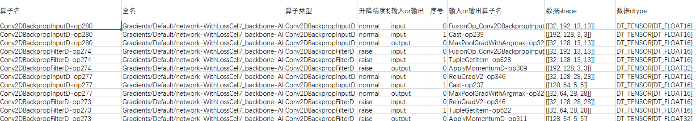

# 网络调试小工具：

## 应用场景1：根据保存的pb文件，识别图中算子执行后精度变化
在mindspore混合精度等场景中，有时需要分析网络算子精度变化，此接口提供分析网络中每个算子执行期输入输出精度变化。

### 结果展示：
相同算子名为一组，每行展示算子的输入或输出信息及其dtype，
从图中可看出Conv2DBackpropFilterD-op274算子两个输入分别来源于FusionOp_Conv2DBackpropInputD_ReluGradV2-op751
和TupleGetItem-op628算子，并且dtype都是DT_TENSOR[DT_FLOAT16]，
输出用于MaxPoolGradWithArgmax-op325算子，其dtype为DT_TENSOR[DT_FLOAT32]。
所以此算子为升精度算子，表示为raise。



### 如何使用：

- **保存中间编译图**
```python
# 定义网络，设置save_graphs=True 保存pb文件

import mindspore.nn as nn
import mindspore.dataset as ds
import mindspore as ms
import numpy as np
from mindspore.ops import operations as P
from mindspore import Tensor
import mindspore.context as context
import mindspore.common.dtype as mstype
class Net(nn.Cell):
    def __init__(self):
        super(Net, self).__init__()
        self.reshape = P.Reshape()
        self.cast = P.Cast()
        self.expand_dims = P.ExpandDims()
        self.dense = nn.Dense(1,3, activation='relu')
        self.flatten = nn.Flatten()
    
    def construct(self, x):
        x = self.reshape(x, (2,3))
        x = self.expand_dims(x, -1)
        x = self.cast(x, mstype.float32)
        x = self.dense(x)
        output = self.flatten(x)
        return output
def generator():
    for _ in range(20):
        x = Tensor(np.random.random((6,)), mstype.float64)
        yield x, Tensor([1, 0], mstype.int32)
def train(net):
    optimizer = nn.Momentum(net.trainable_params(), 1, 0.9)
    loss = nn.SoftmaxCrossEntropyWithLogits(sparse=True)
    data = ds.GeneratorDataset(generator, ['data', 'label'])
    model = ms.Model(net, loss, optimizer)
    model.train(1, data)

if __name__ == '__main__':
    context.set_context(mode=context.GRAPH_MODE,device_target='Ascend', device_id=0, 
            save_graphs=True, save_graphs_path='./graphs_path')
    net = Net()
    train(net)
```
        

- **接口使用**
```python
# 导入precision_tracker接口
from troubleshooter.wigdet import precision_tracker
......
# 执行分析
abs_pb_filepath = './graphs_path/xxx.pb'
precision_tracker(abs_pb_filepath)
```
